# Animate scopes

To add animations to Views run `yarn add @viewstools/animations` in the main folder of your project.

## Add animations to properties

Say we want to animate the `width` of a simple button:

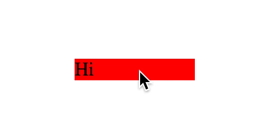

```
Button Vertical
backgroundColor red
onClick <
width 100
Label Text
text Hi
```

First we need to add a condition (scope) to the Vertical. Animations
can be only triggered when the condition value changes (true/false):

```
Button Vertical
backgroundColor red
onClick <
width 100
when <isClicked
width 150
Label Text
text Hi
```

Animations work on scopes and require base value on the base scope.
You can think of scopes as animation frames.

Base scope is always a starting frame and each scope defines next frame.

This wouldn't work (there is no width property on the base scope):

```
Button Vertical
## (base scope starts)
backgroundColor red
onClick <
## (base scope ends, isClicked scope starts)
when <isClicked
width 150
## (isClicked scope ends)
Label Text
text Hi
```

Add name of the curve after the value to animate any animatable property.
We want to animate `width` after the button is clicked, so we add `spring` after width's value in the `isClicked` scope:

```
ButtonAnimatedWidth Vertical
backgroundColor red
onClick <
width 100
when <isClicked
width 150 spring
Label Text
text Hi
```

Here's the code auto-generated by the Morpher from the ButtonAnimatedWidth.view file.
[ButtonAnimatedWidth.view.logic.js](ButtonAnimatedWidth.view.logic.js)

## Animation curves

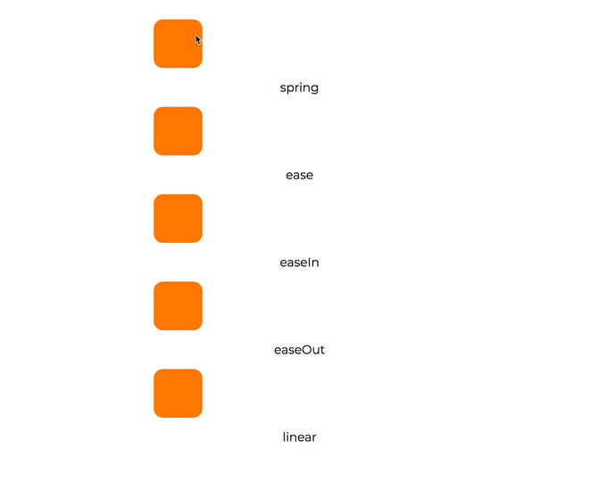

### Spring

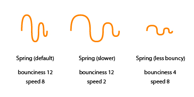

Max `speed 40` `bounciness 40`

Syntax examples:

* `width 150 spring`
* `paddingLeft 20 spring bounciness 20`
* `marginTop 10 spring bounciness 20 speed 20`
* `translateY 10 spring bounciness 20 speed 20 delay 300`

Configuration examples:


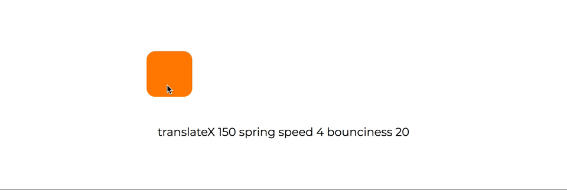

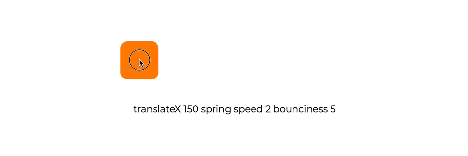


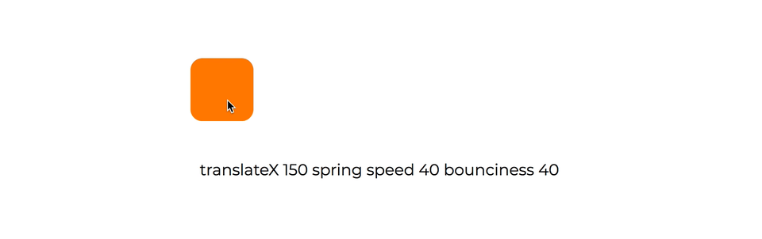

### EaseIn

No maximum. Default duration 150.

Syntax examples:

* `width 150 easeIn`
* `paddingLeft 20 easeIn duration 300`
* `translateX 20 easeIn duration 300 delay 300`

Configuration examples:

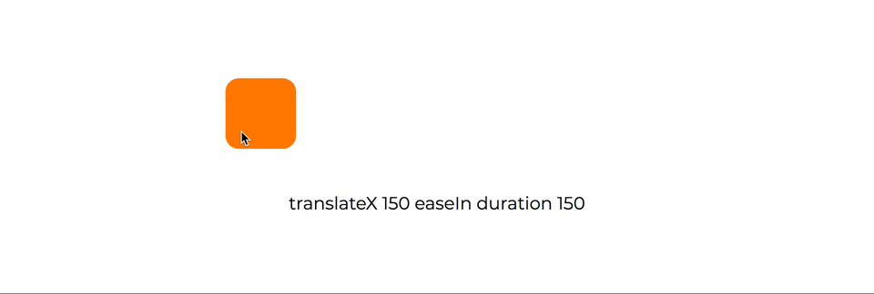


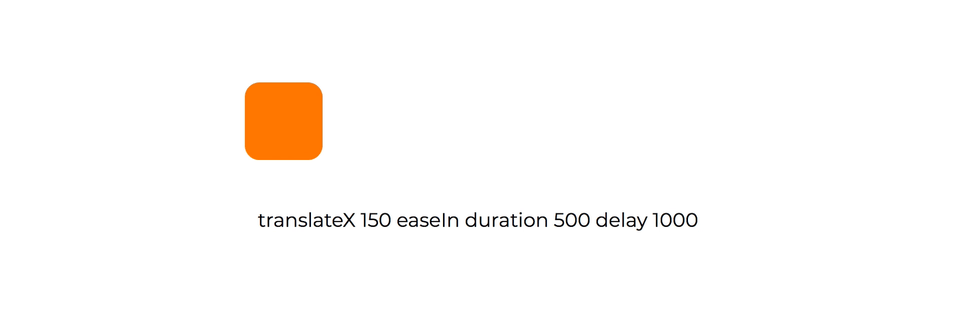

### EaseOut

No maximum. Default duration 150.

Syntax examples:

* `height 150 easeOut`
* `left 20 easeOut duration 300`
* `scale 20 easeOut duration 300 delay 300`

Configuration examples:

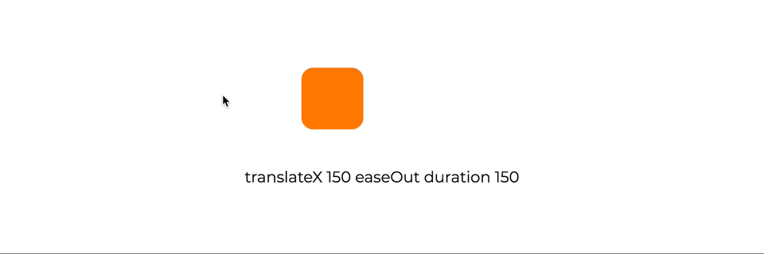


### Ease

No maximum. Default duration 150.

Syntax examples:

* `rotate 150 ease`
* `bottom 20 ease duration 300`
* `translateY 20 ease duration 300 delay 300`

Configuration examples:


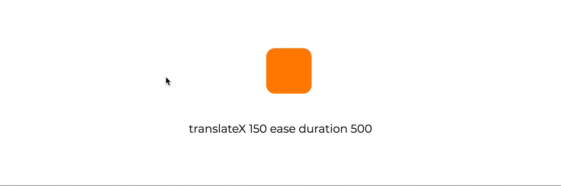


### Linear

No maximum. Default duration 150.

Syntax examples:

* `maxWidth 150 linear`
* `right 20 linear duration 300`
* `flexGrow 3 linear duration 300 delay 300`

Configuration examples:

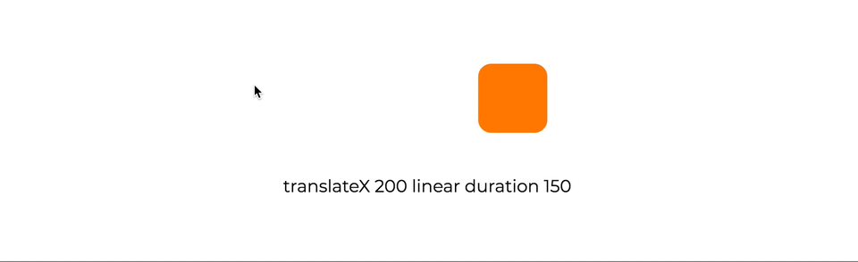


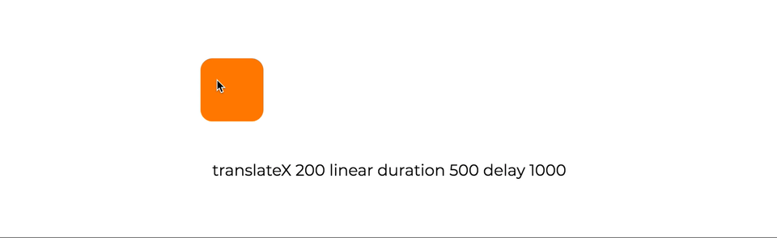

## Delay

Add `delay` to any animated property with a milliseconds value, like in the examples above.

In the Hurray button we are delaying the padding's animation:

```
paddingLeft 100 easeOut delay 500
paddingRight 100 easeOut delay 500
```


## List of all animated properties

In general, all the numerical value properties can be animated.

### Animatable Layout props

* width
* height
* maxWidth
* maxHeight
* minWidth
* minHeight
* flexGrow (wow!)
* bottom
* top
* left
* right

### Animatable Spacing props

All margins and paddings can be animated! Make something fancy ⭐️!

### Animatable Color props

Animations work on color, backgroundColor, and opacity, including spring curves 🤩. Funky!

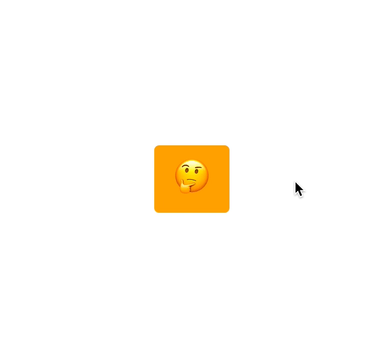

### Animatable Transform props

* scale
* translateX
* translateY
* rotate

### Animatable Border props

* borderWidth
* borderColor
* all border radius props
* outlineColor
* outlineWidth

## Combine animated properties

You can animate more than one property in a block, although you will get the best
results if you will use only one spring animation per block.


Here we are animating:

* scale
* backgroundColor
* paddingLeft
* paddingRight

```
ButtonBounce Horizontal
onClick <
alignItems center
justifyContent center
paddingBottom 10
paddingLeft 20
paddingRight 20
paddingTop 10
borderTopLeftRadius 5
borderTopRightRadius 5
borderBottomLeftRadius 5
borderBottomRightRadius 5
backgroundColor #ffaa00
scale 1
when <isClicked
scale 1.5 spring bounciness 20
backgroundColor #00c276 linear
paddingLeft 100 easeIn
paddingRight 100 easeIn
Text
color #ffffff
fontFamily Montserrat
fontSize 18
fontWeight 400
text Click Me
when <isClicked
text Hurray!!!
fontSize 28 linear
fontFamily Lobster
```

As you can see the text also changes when condition `isClicked` get's toggled on.
Same goes for animations. You can animate many properties across blocks
and scopes.

Side note. Any interactive blocks need some sort of logic to make them fully functional.
Here's an example of the logic file we've used in our animated example. Save it together
with the `ButtonBounce.view` file.
[ButtonBounce.view.logic.js](ButtonBounce.view.logic.js)

## Transitions, lists, loops, and Tools

We still need to use JavaScript to animate transitions between views.
Here's an example of a function used in a logic file that does the trick for now.
Transitions and loops will be added to the next major release. 😊

We are also working on animating list's items. Here's an example of what's
possible today using Javascript in the logic file.

Views Tools beta will support props animations!

## Known issues - work in progress

* There can be only one spring animation in the view
* EaseInOut curve has a bug and currently doesn't work
* delay on spring curves doesn't work

Big thank you to `@amymc` for the massive contribution! 🎁 🎈 🎊

Reach out with questions via our [Slack Questions Channel](https://slack.viewsdx.com/).
Mention `@tom` or `@dario` to make sure that we get your notifications.
