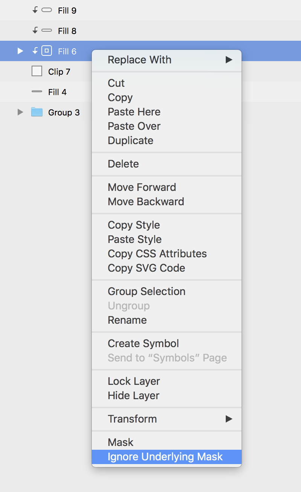
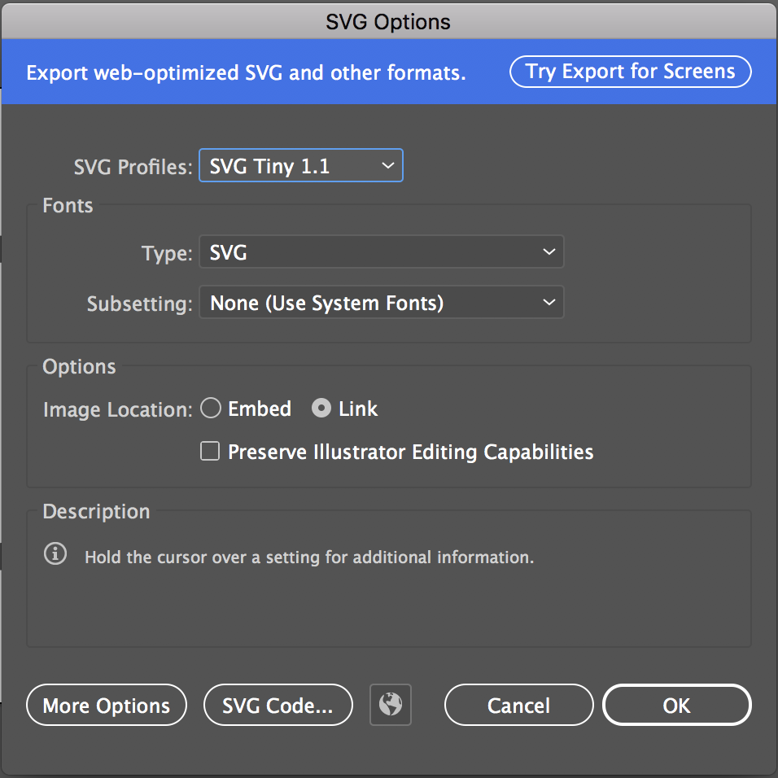
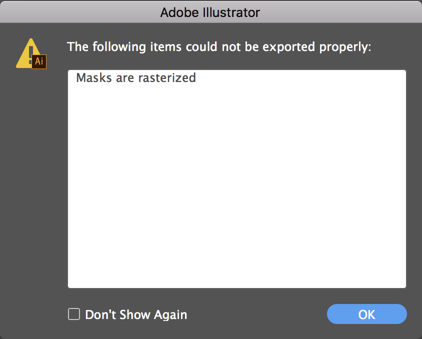
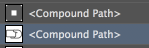
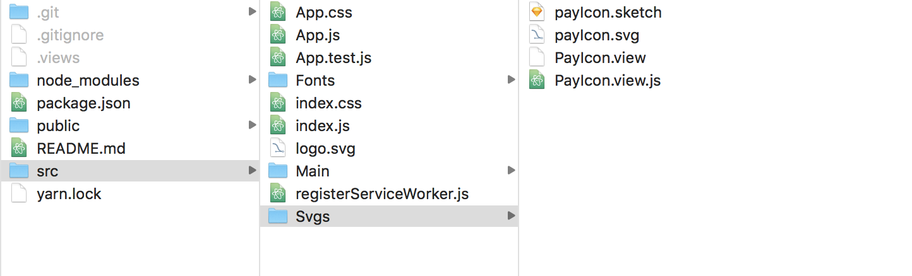
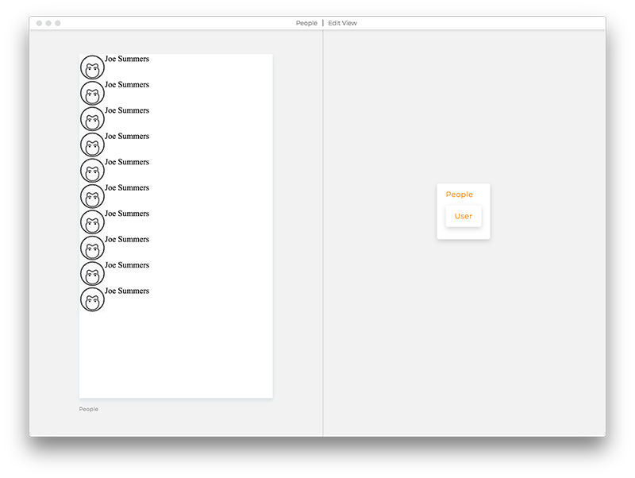
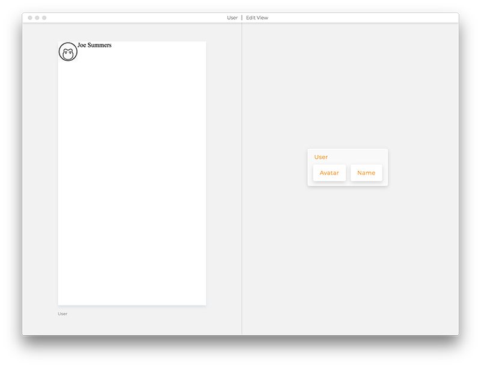
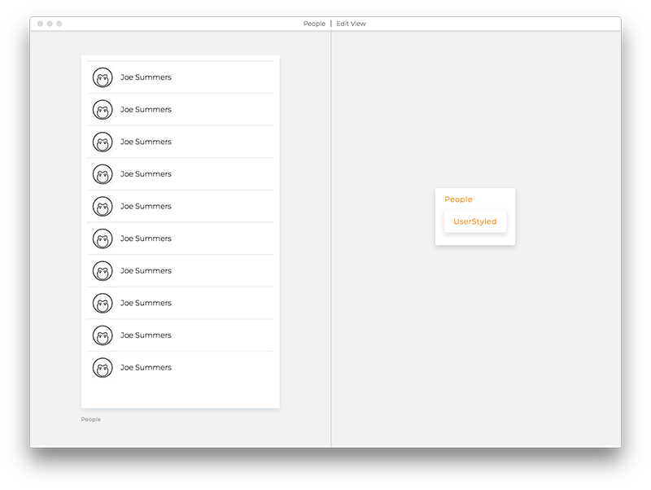

# Examples of basic blocks - Content blocks

## Basic Text block

```views
Text
text Buy Now!
```

## Named Text block

```views
Label Text
text Buy Now!
```

## Text block with interpolated dynamic prop

To embed dynamic values inside a text value, use a simple slot and pass the dynamic
value from the `.view.logic.js`, like:

```views
Text
text <greeting
```

Then in the `.view.logic.js` file use:

`greeting={`Welcome ${props.username}`}`

This will render in the view as `Welcome Joe`.

Another way of doing it would be to split the Text into two Text blocks:

```views
Horizontal
Text
text Welcome

Text
text <username
```

## Image

`Image` takes a `source` property, it can be a URL or a local file.

```views
UserAvatar Image
source https://viewsdx.s3.amazonaws.com/userAvatar.png
```

If you use Views Tools, save your images in `Images` folder inside your project. Tools will automatically convert all images from that folder into `.view` files and into React components (`.view.js` files), when you open the project in Views Tools. You can treat the `Images` folder as a working directory and keep all your original files in there.

Important: Any files, images, SVGs, views have to start with a capital letter due to the way that JavaScript works.

## Captures

`Capture` is your way to accept written input from a user. We have a few types
defined for this:

* `CaptureEmail`
* `CaptureFile`
* `CaptureInput`
* `CaptureNumber`
* `CapturePhone`
* `CaptureSecure`
* `CaptureText`
* `CaptureTextArea`

To set content of a any capture field use `placeholder` property. Example:

```
Email CaptureEmail
placeholder john@email.com
```

You can change the placeholder's styles with the `placeholder` scope:
```
Email CaptureEmail
color blue
placeholder john@email.com
when <placeholder
color green
```

To auto focus in a Capture field use `autoFocus` property. Example:
```
CaptureText
autoFocus true
```

The React docs for [DOM](https://reactjs.org/docs/forms.html) and
[native](https://facebook.github.io/react-native/docs/textinput) apply.
If you have very complex forms, I'd recommend you use
[formik](https://github.com/jaredpalmer/formik). It will help structure the
logic for your forms without dictating UI.

### Getting the Capture's value
Say we have a view called `MyInput.view` like:
```
MyInput CaptureText
value <
onChange <
```

To control and get its value we can add a logic file to it that deals with
`value` and the `onChange` event:

```
import MyInput from './MyInput.view.js'
import React from 'react'

class MyInputLogic extends React.Component {
  state = {
    value: '' // starts empty
  }

  onChange = event => {
    // React DOM and native differs in how you get the value for your inputs.

    // For DOM use:
    this.setState({ value: event.target.value })
    // For Native use:
    this.setState({ value: event.nativeEvent.text })
  }

  render() {
    return (
      <MyInput
        {...this.props}
        {...this.state}
        onChange={this.onChange}
      />
    )
  }
}
export default MyInputLogic
```

### Adding a keyboard spacer in React Native
If you're coming from a web background, this could be a head scratcher since
native apps expect us to manage how the software keyboard affects our UI. We've
used this code to some success in iOS so far. We would love to hear what worked
for you!

Add a `src/KeyboardSpacer.js` file to your project like this:
```
// @view
import { Platform } from 'react-native';
import KeyboardSpacer from 'react-native-keyboard-spacer';
import React from 'react';

export default props => Platform.OS === 'ios' ? <KeyboardSpacer {...props} /> : null;
```

Add a `src/KeyboardSpacer.view.fake` file to tell Views Tools how
to display it while designing your app. This file won't be used in production.
```
KeyboardSpacerFake Vertical
Image
source ./KeyboardSpacerFake.png
width 100%
height 220
```
Download [KeyboardSpacerFake.png](./KeyboardSpacerFake.png) to `src/KeyboardSpacerFake.png`.

Finally, use the spacer in your view like:
```
Settings Vertical
flexGrow 1
flexShrink 1
flexBasis auto
CaptureText
value <
onChange <

KeyboardSpacer
```

React Native has [KeyboardAvoidingView](https://facebook.github.io/react-native/docs/keyboardavoidingview)
but it didn't really work for us as expected. There are also other alternatives
that look promising, like [react-native-spacer](https://www.npmjs.com/package/react-native-spacer).

### Setting the return key type/label in React Native
Native apps let you specify how the return key that submits the user's input
look like. In React Native you use the `returnKeyType` prop with one of the
possible values: `done`, `go`, `next`, `search`, or `send`.
[Docs](https://facebook.github.io/react-native/docs/textinput#returnkeytype).

```
CaptureText
returnKeyType go
```

### Default values in React Native
We've added the following defaults to Captures morphed to React Native that came
after our use of it. You can override any of them:
```
autoCorrect false
underlineColorAndroid transparent
textAlignVertical top
```

## Svgs

_SVGs are amazing_. They let you do amazing graphics that scale like crazy.
Of course you can use an `Image` block to just show an SVG file as an image
but if you want to do more crazy stuff with them, like animating parts of it
or changing how it looks like on the fly, you're better off using an `Svg`
block. Inside it, you can use a these specific blocks:

* `SvgCircle`
* `SvgEllipse`
* `SvgGroup`
* `SvgLinearGradient`
* `SvgRadialGradient`
* `SvgLine`
* `SvgPath`
* `SvgPolygon`
* `SvgPolyline`
* `SvgRect`
* `SvgSymbol`
* `SvgText`
* `SvgUse`
* `SvgDefs`
* `SvgStop`

While you can make an `Svg` by hand, like:

```views
Svg
viewBox 0 0 20 20
width 20
height 20
SvgCircle
cx 10
cy 10
r 5
stroke deepskyblue
```

Tips and trick on how to export SVGs to make them production compliant:
Sketch App
Select layers with arrows pointing down next to the name, right click and chose Ignore Underlying Masks option.


Illustrator
When you saving file as an Svg make sure to select Tiny 1.1 format:


Rasterised masks will cause compilation errors:


To avoid unwanted masks convert paths to Compound Paths:


If you use Views Tools, save your Svgs in `Svgs` folder inside your project. Tools will automatically convert all Svgs from that folder into `.view` files and into React components (`.view.js` files) when you open the project. You can treat the `Svgs` folder as a working directory and keep all your original files in there.


Important: Any files, images, SVGs, views have to start with a capital letter due to the way that JavaScript works.

# Containers

_Container_ blocks let you group blocks together. They are:

* `Vertical`
* `Horizontal`
* `List`

## Button

Button with an icon on the side:

```views
Button Horizontal
onClick props
Icon Svg
width 15
height 15
viewBox 0 0 25 25
SvgPath
d M24.5 9.7c-.2-.4-.5-.6-.9-.7l-7.1-1-3.2-6.4c-.3-.7-1.5-.7-1.8 0L8.4 8l-7 1c-.4.1-.7.3-.9.7s0 .8.3 1l5.1 5-1.2 7.1c-.1.4.1.8.4 1 .2.1.4.2.6.2.2 0 .3 0 .5-.1l6.3-3.3 6.3 3.3c.3.2.7.1 1.1-.1.3-.2.5-.6.4-1l-1.2-7.1 5.1-5c.3-.3.4-.6.3-1z


Label Text
text Buy Now!
```

Button with an icon on the top:

```views
Button Vertical
onClick props
Icon Svg
width 15
height 15
viewBox 0 0 25 25
SvgPath
d M24.5 9.7c-.2-.4-.5-.6-.9-.7l-7.1-1-3.2-6.4c-.3-.7-1.5-.7-1.8 0L8.4 8l-7 1c-.4.1-.7.3-.9.7s0 .8.3 1l5.1 5-1.2 7.1c-.1.4.1.8.4 1 .2.1.4.2.6.2.2 0 .3 0 .5-.1l6.3-3.3 6.3 3.3c.3.2.7.1 1.1-.1.3-.2.5-.6.4-1l-1.2-7.1 5.1-5c.3-.3.4-.6.3-1z


Label Text
text Buy Now!
```

## List of cards



List of cards:

```views
People List
from <
User
```

List repeats one view. The item has to be saved as a `.view` file within your project
and it CANNOT be a basic block, like Text or Image.

In this example `User.view` file looks like this:



```views
User Horizontal
Avatar Image
source <userAvatar https://viewsdx.s3.amazonaws.com/userAvatar.png

Name Text
text <userName Joe Summers
```



Styled user card in a list would look more like this:

```views
User Horizontal
alignItems center
paddingTop 10
paddingLeft 10
paddingRight 10
marginTop 10
marginLeft 10
marginRight 10
borderTop 1px solid #e6e6e6
Avatar Image
source <userAvatar https://viewsdx.s3.amazonaws.com/userAvatar.png
width 40
height 40

Name Text
text <userName Joe Summers
fontSize 14
fontFamily Montserrat
fontWeight 300
marginLeft 15
```

By default, list cards will be keyed by their order in the list (`index`). To set the key
to something other than `index` in the list, add a `key` prop to the card like:

```
List
from <
Card
key id
```

It will map to `key={item.id}`.

Reach out with questions via our [Slack Questions Channel](https://slack.views.tools/).
Mention `@tom` or `@dario` to make sure that we get your notifications.
