# Views Composition Model

## Atomic Design

Views uses [Atomic Design Composition Pattern](http://patternlab.io/) to ensure
interface consistency across all views.

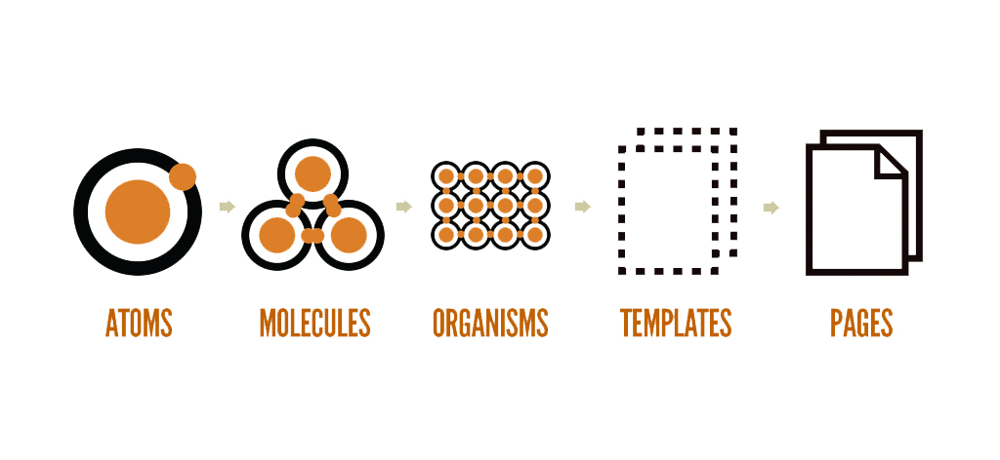

Views composition model is a collection of embeddable blocks.

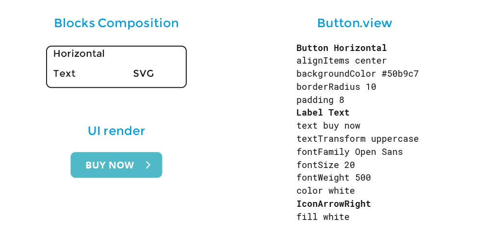

Every `.view` file is a self contained component with a top level container block and content blocks.
As a component it can be used inside of any other `.view` file and styled at point of use.

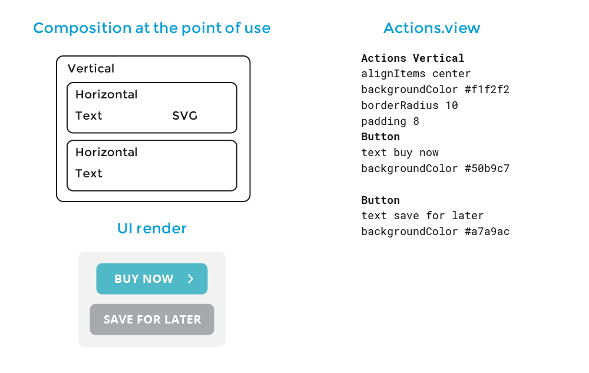

The power of the atomized composition model allows components to become reusable templates as the
app's functionality and the design system grows.

We use [Yoga layout engine](https://github.com/facebook/yoga)

## Containers and content blocks

Containers wrap other blocks, displace, and align them.


### Containers

1.  Horizontal distributes blocks inside next to each other.
2.  Vertical distributes blocks inside on top of each other.
3.  List repeats one block based on the amount of passed data.
    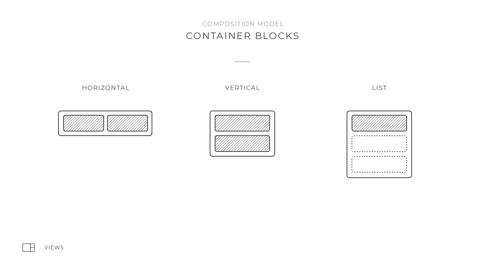

Examples of final interface
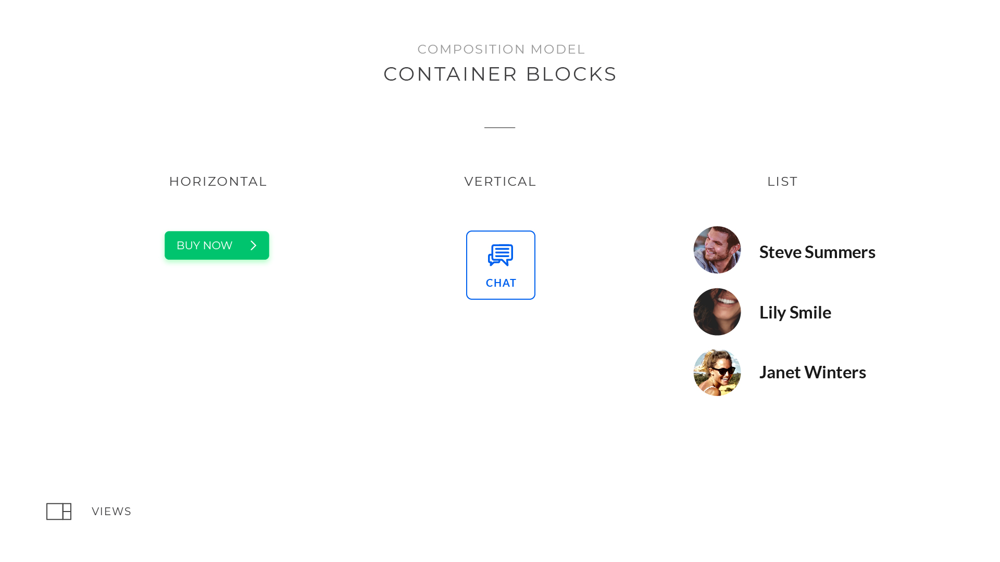

[More on containers](../Blocks/README.md)

### Content blocks

1.  Capture block lets you capture user input as data.
2.  Image block displays graphic files, like JPGs, PNGs, GIFFs, and more
3.  Text block renders text in the view.
4.  SVG block renders vector graphics.
    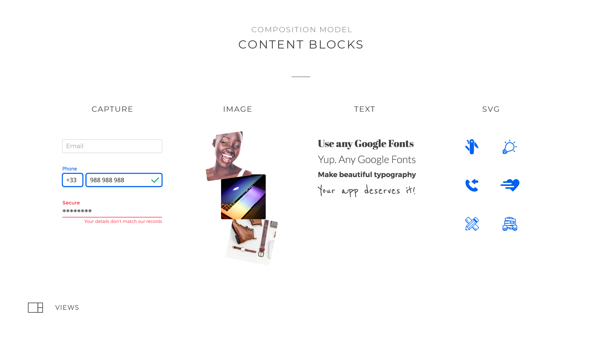

[Examples of basic blocks](../Blocks/README.md)

## Indentation and the Composer

Indentation (when you use code editor) is how we do composition inside a view.
You can think about your view as a stack of blocks where new lines set blocks apart.

Composer is a composition tool, and comes with Views Tools.

**Example #1 In Composer**

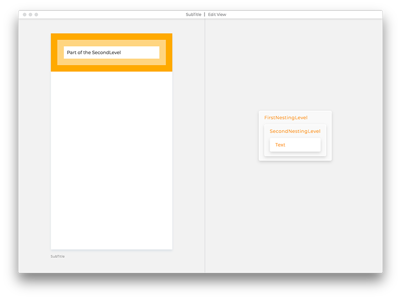

**Example #1 In Code**

```views
FirstNestingLevel Vertical
  SecondNestingLevel Vertical
    Text
```

In the example above, the hierarchy is:

* `FirstNestingLevel`
  * `SecondNestingLevel`
    * `Text`

**Example #2 In Composer**

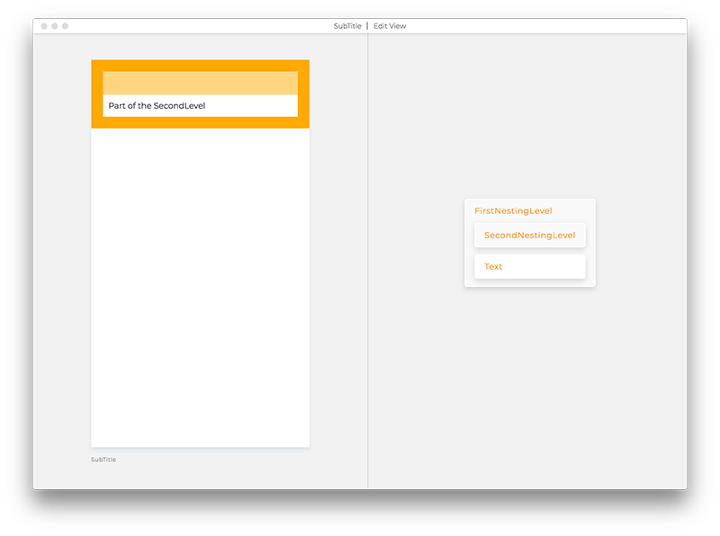

**Example #2 In Code**

What if we want to have the text at the same level of `InsideTop`? Our code
would look like:

```views
FirstNestingLevel Vertical
  SecondNestingLevel Vertical
  Text
```

Our hierarchy now looks like:

* `FirstNestingLevel`
  * `SecondNestingLevel`
  * `Text`

Every view with more than one block needs a top-level container.
In the example above, `Text` is outside of the top level container
and it won't render in the view.

```
Top Vertical
Text
```

## Save and re-use .view files

Views can be used as part of other views by referencing their file name.

Common use case: Say you have a View that contains a button with a text label and
you want to choose different label, or the fontSize depending where you use it.

Here're simple steps to extract blocks and re-use them:

1.  Save the button code to separate .view file and give it a name
    starting with a capital letter
2.  Replace the previous button code with only the name of the extracted View,
    in our example it's `Filename`
3.  From now on `Filename.view` is your Custom block and you will
    see it being updated across your app upon any new changes.

### Use case one - change text at the point of use

This is a simple View with one Text block BEFORE using it as a Custom Block:

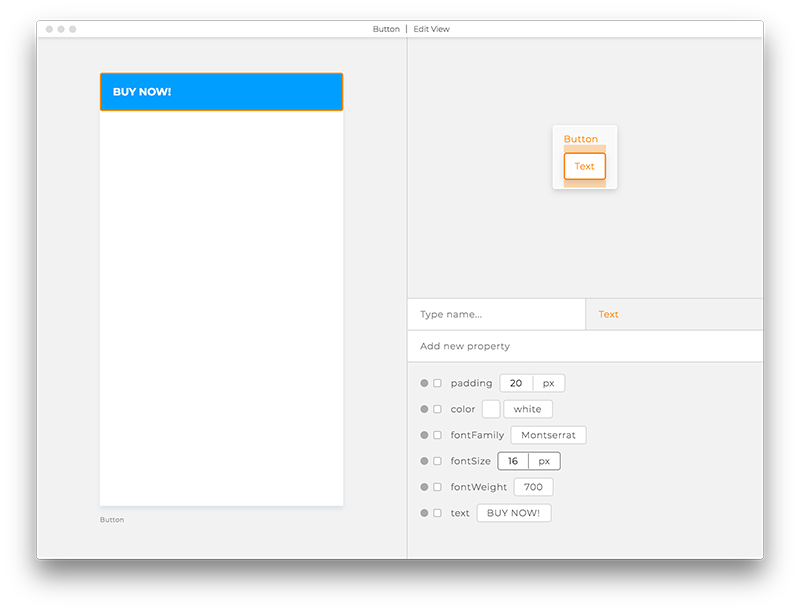

**before**

```views
Button Vertical
  backgroundColor #009fff
  borderTopLeftRadius 8
  borderTopRightRadius 8
  borderBottomLeftRadius 8
  borderBottomRightRadius 8
  Text
    color white
    fontFamily Montserrat
    fontSize 16
    fontWeight 700
    paddingBottom 20
    paddingLeft 20
    paddingRight 20
    paddingTop 20
    text BUY NOW!
```

Take all the lines of the `Text` block and paste them to a new document. Save it
within your project as `Label.view`. If you want to reuse the `Label` in many places with
different text, turn it into slot by adding `<` before the value.

```views
Label Text
  color white
  fontFamily Montserrat
  fontSize 16
  fontWeight 700
  paddingBottom 20
  paddingLeft 20
  paddingRight 20
  paddingTop 20
  text < default label
```

And here's how it should look like AFTER saving `Text` as `Label.view` file
and using it in the `Button.view` file:


**after**

```views
Button Vertical
  backgroundColor #009fff
  borderTopLeftRadius 8
  borderTopRightRadius 8
  borderBottomLeftRadius 8
  borderBottomRightRadius 8
  Label
    text BUY NOW!
```

### Use case two - change the size of the font in one place

Back to our example. To change the font size in all instances of `Button.view`
change the `fontSize` value directly in the `Label`:

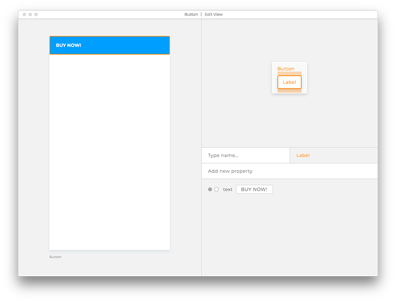

**before**

```views
Button Vertical
  backgroundColor #009fff
  borderTopLeftRadius 8
  borderTopRightRadius 8
  borderBottomLeftRadius 8
  borderBottomRightRadius 8
  Label
    text BUY NOW!
```

```views
Label Text
  color white
  fontFamily Montserrat
  fontSize 14
  fontWeight 700
  paddingBottom 20
  paddingLeft 20
  paddingRight 20
  paddingTop 20
  text < default label
```

And here's how it should look like AFTER saving `Text` as `Label.view` file
and using it in the `Button.view` file:

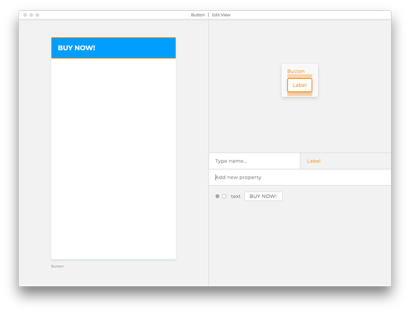

**after**

```views
Button Vertical
  backgroundColor #009fff
  borderTopLeftRadius 8
  borderTopRightRadius 8
  borderBottomLeftRadius 8
  borderBottomRightRadius 8
  Label
    text BUY NOW!
```

Notice that we've changed the `fontSize` value in the `Label.view` and the `Button.view`
is affected but doesn't "know" anything about that change, since it happened in self-contained
`Label` file.

```views
Label Text
  color white
  fontFamily Montserrat
  fontSize 20
  fontWeight 700
  paddingBottom 20
  paddingLeft 20
  paddingRight 20
  paddingTop 20
  text < default label
```

Reach out with questions via our [Slack Questions Channel](https://slack.views.tools/).
Mention `@tom` or `@dario` to make sure that we get your notifications.
