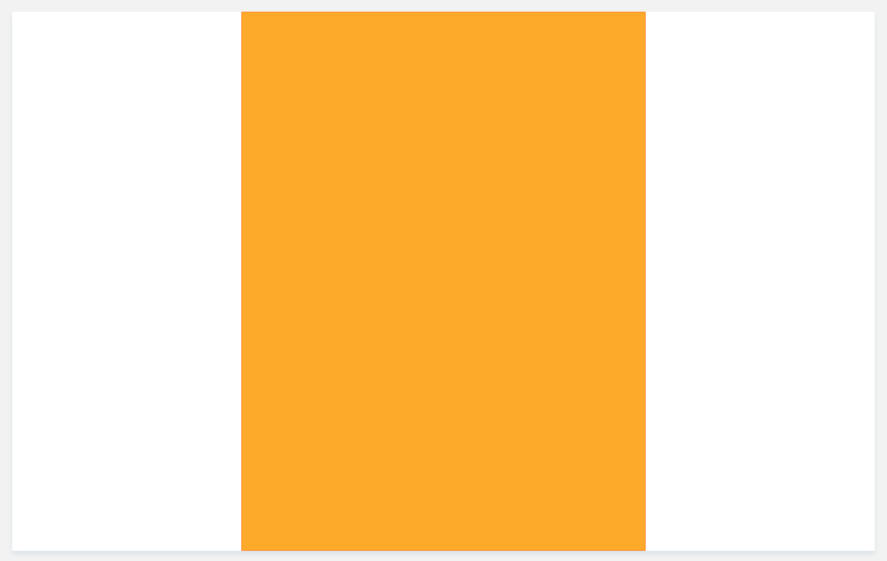

# Known CSS Ticks

Here we collect useful CSS tricks we use to solve known issues in layouts we design.

1. If you want to keep the width of the centred layout within a specific width
   add `maxWidth` and some pixel value, like 600, on the container, but also add
   `width 100%` to the same container to prevent the container's content collapsing
   
