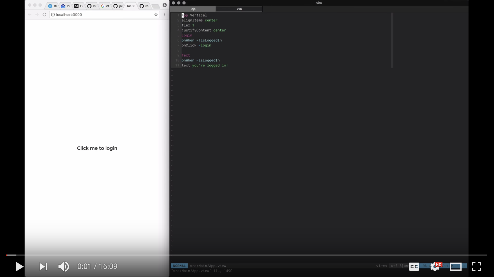

# .view.logic.js

Any View file can be also wrapped with JavaScript logic to make a Smart View.

With `Counter.view` file like:

```
Text
  color black
  text <number 1
```

We can add a `Counter.view.logic.js` file that would increment a number by one
every second like this:

```
import Counter from './Counter.view.js'
import React, { useEffect, useState } from 'react'

let CounterLogic = props => {
  let [number, setNumber] = useState(0)

  useEffect(() => {
    let interval = setInterval(() => setNumber(number + 1), 1000)
    return () => clearInterval(interval)
  })

  return <Counter number={number} />
}
export default CounterLogic
```

A logic file is an extension to your view and Views imports that it if it's
available. In other words, if you then use your `Counter` in other views, you
will actually be using the `Counter.view.logic.js` instead.

This is where you would add any intermediate state to your views or connect them
to an external store of data.

## Control global state

Here's the video to the session that shows how to manage global state:

[](https://youtu.be/kUT0crvNhoA)

Here's the link to the [repo shown in the video](https://github.com/viewstools/dealing-with-global-app-state).

## Example on showing a list data coming from a service

We would use logic files for that containing the logic to fetch external data.

Say you have a `Posts.view` like:
```
Posts List
  from <
  Post
```

And another one `Post.view` (to show the actual post):
```
Post Vertical
  Text
    text <title This is the title
  Text
    text <body This is the body of the post. Lots of stuff goes in here.
```

You’d then add a `Posts.view.logic.js` file that will have the fetching logic in React like:
```
import React, { useState, useEffect } from 'react'
import Posts from './Posts.view.js'

export default function PostsLogic(props) {
  let [ posts, setPosts ] = useState([])
  useEffect(() => {
    fetch('https://jsonplaceholder.typicode.com/posts')
      .then(res => res.json())
      .then(setPosts)
  },  [])

  return <Posts {...props} from={posts} />
}
```

So say you’re then using the `Posts` in `App.view` like:
```
App Vertical
  Posts
```

Views Morpher will recognise the logic file automatically for you and use that instead of the view.

In Views Tools you will see three elements rendered on the list with placeholder data on it so you can design it.

Reach out with questions via Github Issues [Github Issues](https://github.com/viewstools/docs/issues).
Mention `@tombrewsviews` or `@dariocravero` to make sure that we get your notifications.