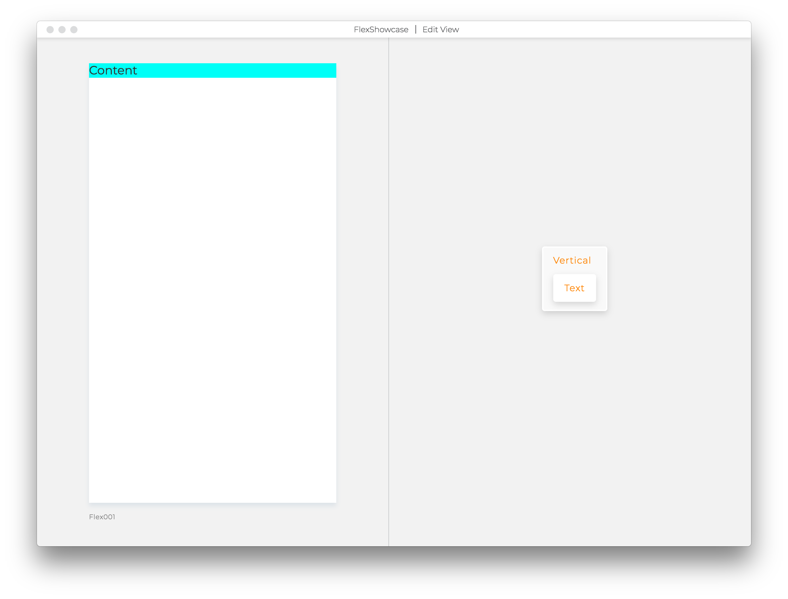
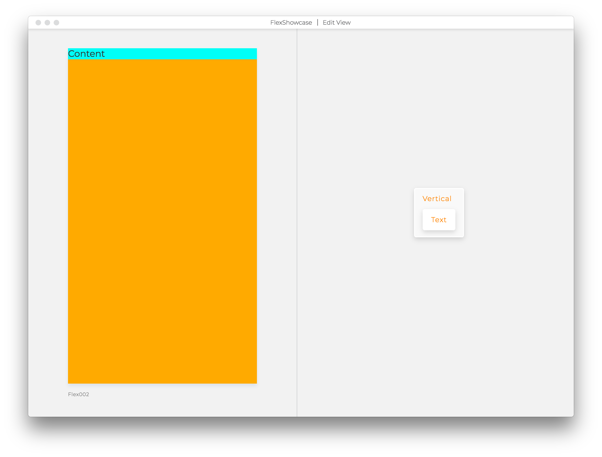
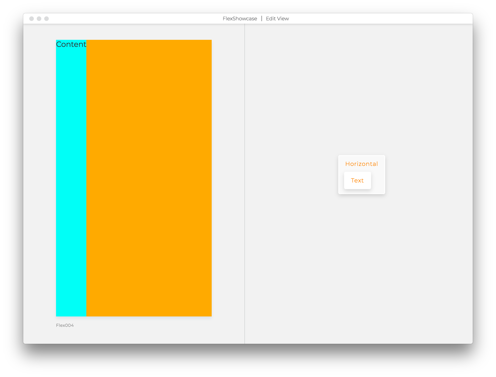
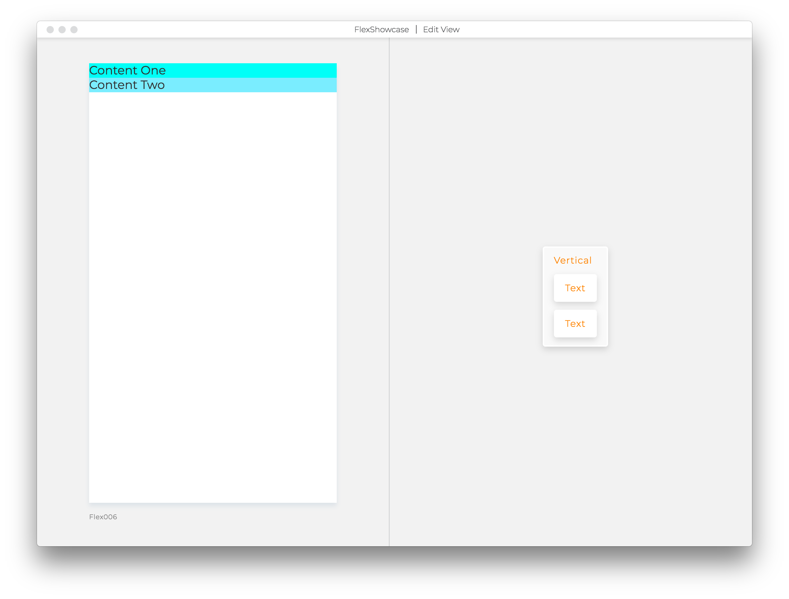
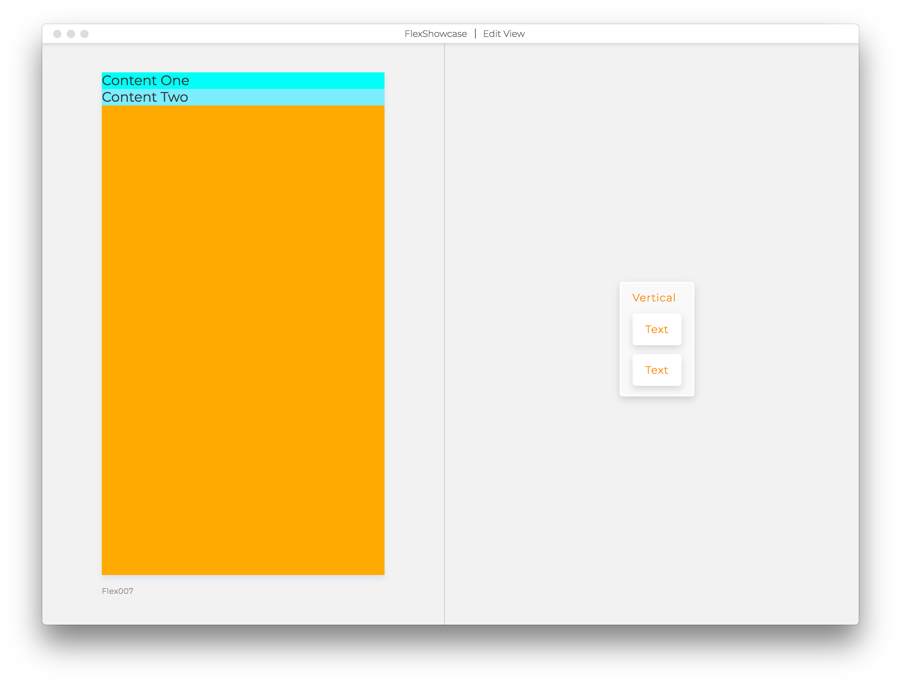
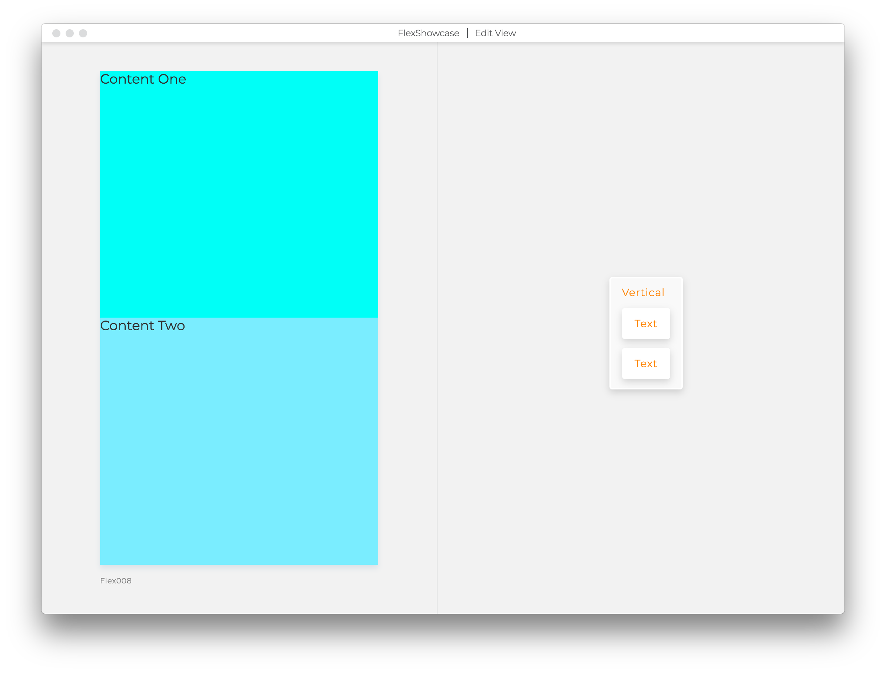
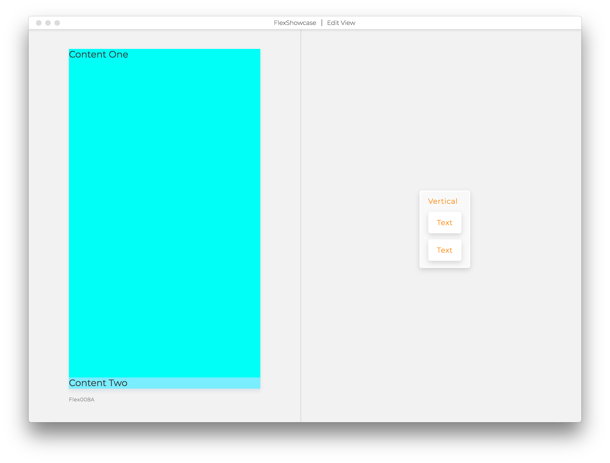
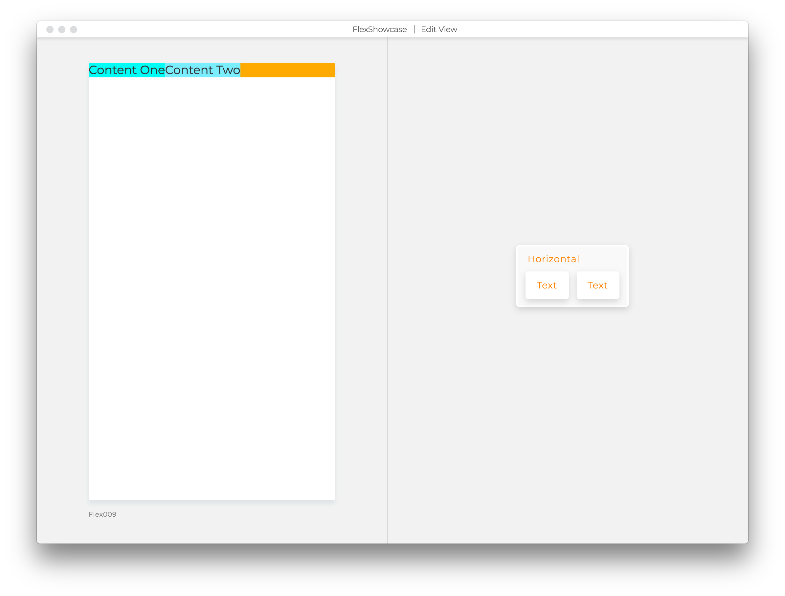
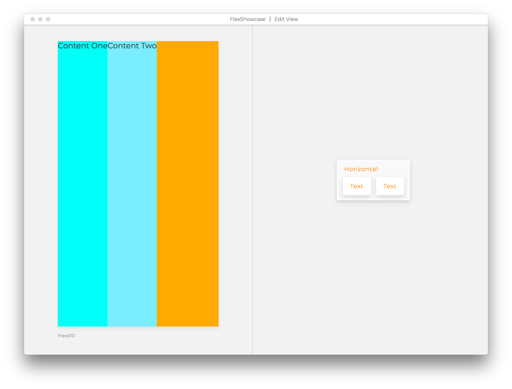

# Flex 1

Side note: Every block, by default, has `display flex` property enabled.

When you apply `flex 1` to a block, it will try to take as much space as it's
possible in the view. Check how the examples below are affected by this property,
and as a rule of thumb, add `flex 1` to blocks, when you need them to push
other blocks away, or take more space.

#### 001. No flex 1

```views
FlexTest Vertical
backgroundColor #ffaa00
Text
backgroundColor #00fff7
color #323232
fontFamily Montserrat
fontSize 18
fontWeight 400
text Content
```

#### 002. Flex on the Vertical only

```views
FlexTest Vertical
flex 1
backgroundColor #ffaa00
Text
backgroundColor #00fff7
color #323232
fontFamily Montserrat
fontSize 18
fontWeight 400
text Content
```
#### 003. Flex on the Vertical and on the Text block

```views
FlexTest Vertical
flex 1
backgroundColor #ffaa00
Text
flex 1
backgroundColor #00fff7
color #323232
fontFamily Montserrat
fontSize 18
fontWeight 400
text Content
```

#### 004. Flex on the Horizontal only

```views
Horizontal
flex 1
backgroundColor #ffaa00
Text
backgroundColor #00fff7
color #323232
fontFamily Montserrat
fontSize 18
fontWeight 400
text Content
```

#### 005. Flex on the Horizontal and Text

```views
Horizontal
flex 1
backgroundColor #ffaa00
Text
flex 1
backgroundColor #00fff7
color #323232
fontFamily Montserrat
fontSize 18
fontWeight 400
text Content
```
#### 006. No Flex 1 on the Vertical or on nested blocks

```views
Vertical
backgroundColor #ffaa00
Text
backgroundColor #00fff7
color #323232
fontFamily Montserrat
fontSize 18
fontWeight 400
text Content One
Text
backgroundColor #00fff7
color #323232
fontFamily Montserrat
fontSize 18
fontWeight 400
text Content Two
```

#### 007. Flex only on the Vertical (with nested blocks)

```views
Vertical
flex 1
backgroundColor #ffaa00
Text
backgroundColor #00fff7
color #323232
fontFamily Montserrat
fontSize 18
fontWeight 400
text Content One
Text
backgroundColor #00fff7
color #323232
fontFamily Montserrat
fontSize 18
fontWeight 400
text Content Two
```

#### 008. Flex on the Vertical and on nested blocks

```views
Vertical
flex 1
backgroundColor #ffaa00
Text
flex 1
backgroundColor #00fff7
color #323232
fontFamily Montserrat
fontSize 18
fontWeight 400
text Content One
Text
flex 1
backgroundColor #00fff7
color #323232
fontFamily Montserrat
fontSize 18
fontWeight 400
text Content Two
```

#### 008A. Flex on the Vertical and on one nested block only

```views
Vertical
flex 1
backgroundColor #ffaa00
Text
flex 1
backgroundColor #00fff7
color #323232
fontFamily Montserrat
fontSize 18
fontWeight 400
text Content One
Text
backgroundColor #7aedff
color #323232
fontFamily Montserrat
fontSize 18
fontWeight 400
text Content Two
```
#### 009. No Flex 1 on the Horizontal or on nested blocks

```views
Horizontal
backgroundColor #ffaa00
Text
backgroundColor #00fff7
color #323232
fontFamily Montserrat
fontSize 18
fontWeight 400
text Content One
Text
backgroundColor #7aedff
color #323232
fontFamily Montserrat
fontSize 18
fontWeight 400
text Content Two
```

#### 010. Flex only on the Horizontal (with nested blocks)

```views
Horizontal
flex 1
backgroundColor #ffaa00
Text
backgroundColor #00fff7
color #323232
fontFamily Montserrat
fontSize 18
fontWeight 400
text Content One
Text
backgroundColor #7aedff
color #323232
fontFamily Montserrat
fontSize 18
fontWeight 400
text Content Two
```

#### 011. Flex on the Horizontal and on nested blocks

```views
Horizontal
flex 1
backgroundColor #ffaa00
Text
flex 1
backgroundColor #00fff7
color #323232
fontFamily Montserrat
fontSize 18
fontWeight 400
text Content One
Text
flex 1
backgroundColor #7aedff
color #323232
fontFamily Montserrat
fontSize 18
fontWeight 400
text Content Two
```

#### 011A. Flex on the Horizontal and on one nested block only

```views
Horizontal
flex 1
backgroundColor #ffaa00
Text
flex 1
backgroundColor #00fff7
color #323232
fontFamily Montserrat
fontSize 18
fontWeight 400
text Content One
Text
backgroundColor #7aedff
color #323232
fontFamily Montserrat
fontSize 18
fontWeight 400
text Content Two
```


Reach out with questions via our [Slack Questions Channel](https://slack.viewsdx.com/).
Mention `@views-tom` or `@dario` to make sure that we get your notifications.
