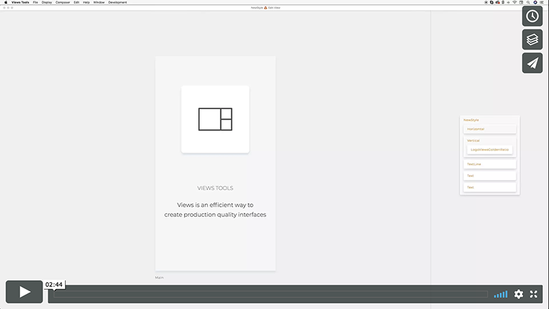
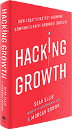

# Views

**An effective framework for creating production quality interfaces**

Views is an intuitive language to define and build complex user interfaces.
Views syntax is clean, intuitive, and functional. Here's a sample:

```views
Text
color deepskyblue
text Hello. Don't be a stranger!
```

There are no divs, classes or ids. We use styled blocks to compose interfaces.
Blocks make the composition easy to understand even for non-technical professionals.

Views lets you build web, iOS, Android and Desktop applications from the same codebase by
morphing to React and React Native in JavaScript. It doesn't add a runtime
overhead to your application.

Views language and its morphers are open source.
[You can contribute here](https://github.com/viewstools/morph).

We're also working on a toolset to enhance the design and development process
even more. It is currently in closed beta and we're expecting to release
the public beta by Q3 2018. Email us at hi@views.tools and we'll let you
know when its ready.

[](https://vimeo.com/248484288)

Join conversations:

* [Spectrum Channel](https://spectrum.chat/?t=ba1ad612-c26e-446f-9aa3-76f0c7ca6c81)
* [Slack Team](https://slack.views.tools/)
* [Medium Publication](https://medium.com/viewsdx)
* [Roadmap](https://trello.com/b/NhIKKbol/views-roadmap)

## How can you benefit from it?

_Views make teams productive._ Designers contribute directly to the production build.</br>
_Views improve build quality._ Designers can tweak styling without wasting dev time.</br>
_Views compile to React and React Native._ No manual work is required in the compilation process.</br>
_Views come with a creative toolset._ For designers who prefer tweak over building from scratch.

You can speed up your development.</br>
Perform faster revision loops.</br>
Test innovative ideas.</br>
Reduce the cost of design iterations.</br>

## Who is using it successfully?

* A strategic partner to deliver their core application to their 50 million users in the USA. _Web app_.
* Views toolset. _Electron Desktop app_.
* 2BFIT. _Mobile native app_ [AppStore](https://itunes.apple.com/us/app/2bfit/id1279427455?mt=8&ign-mpt=uo%3D4) [GooglePlay](https://play.google.com/store/apps/details?id=com.viewsdx.app2bfit&hl=en)
* Classuite. _Mobile native app_. [AppStore](https://itunes.apple.com/us/app/classuite-workspaces/id1329983329?mt=8) [GooglePlay](https://play.google.com/store/apps/details?id=com.classuite.workspces)

## Table of Contents

1.  [Use Views in your project](UseViews/README.md)</br>
    Open source (code driven)</br>
    Using Views Tools (code and WYSIWYG editor for designers)</br>
2.  [Compose Views](CompositionModel/README.md)</br>
    Atomic Design pattern</br>
    Containers and content blocks</br>
3.  [Examples of basic blocks](Blocks/README.md)</br>
    Text, Image, Captures, Svgs</br>
    Button, List of cards</br>
4.  [Use properties to style blocks](Properties/README.md)</br>
    Internal (CSS)</br>
    External (slots)</br>
5.  [Use scope properties](Scopes/README.md)</br>
    Control states of blocks</br>
    Control when blocks are rendered</br>
6.  [Animate scopes](Animations/README.md)
7.  [Keep logic ](Logic/README.md)
8.  [Route views with "at"](Routes/README.md)
9.  [Integrate React components](ReactComponents/README.md)
    Google Map example</br>
    Loaders example</br>
10. [Useful Conventions](Conventions/README.md)
11. [Why not Views?](WhyNotViews/README.md)

## Views is a knowledge transfer platform!

The value of cross-functional teams is very well known to Growth Hacking community
and it's explained well in this book [Hacking Growth: Fastest Growing Companies Breakout](https://www.amazon.com/Hacking-Growth-Fastest-Growing-Companies-Breakout/dp/045149721X)



Views helps build fast experiments that can be expanded to fully featured products
and don't end up thrown away after testing, like it's in a case of prototypes.

Every team that introduced non-technical members using Views on an early stage of
product development noticed massive spikes in productivity, motivation, and cross-domain
knowledge transfer.

_We learn the best from each other and on the job_

Because Views syntax, composition, state and logic concepts are much easier to
grasp than in a typical HTML, CSS, JS stack, non-technical team members have fewer
barriers to start writing code.

_We think that the code we write should be beautiful, meaningful, and simple_

As a collaboration platform Views removes silos and brings down the walls between
development and the rest of the organisation.

_We cherish openness, learning, and frequent shipping_

## 😍 How can I help?

We're thrilled you want to help us make better UIs together 😀.
[Guidelines on contributions to the Morphers](https://github.com/viewstools/morph/blob/master/CONTRIBUTING.md)

### Thank you to our main contributors ⊃━☆ﾟ. \* ･ ｡ﾟ

Amy https://github.com/amymc</br>
Larrisa https://github.com/callogerasl</br>
Dario https://github.com/dariocravero</br>
Tom https://github.com/tomatuxtemple</br></br>

[All Morpher contributors](https://github.com/viewstools/morph/graphs/contributors)</br>
[All Docs contributors](https://github.com/viewstools/docs/graphs/contributors)</br>

License BSD-3-Clause.<br>
Copyright 2017 by UXtemple Ltd.
