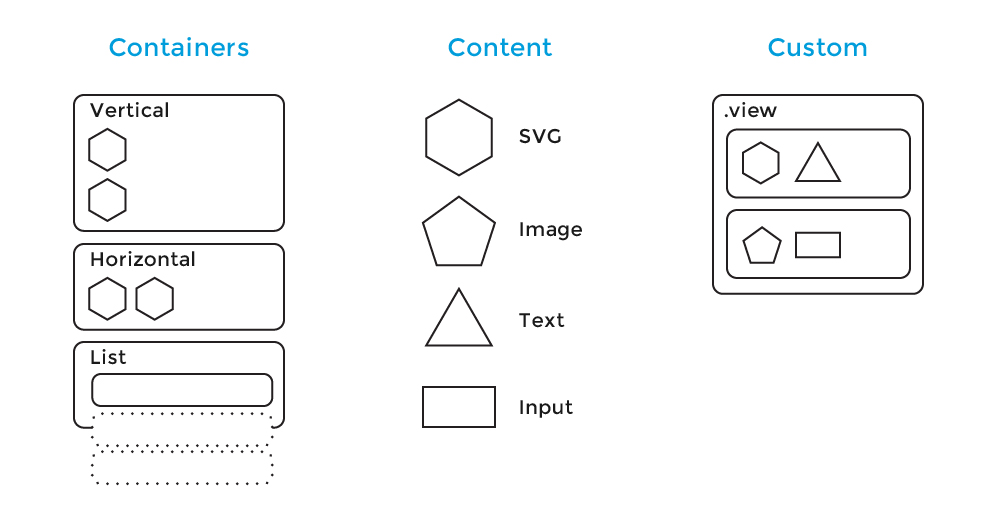
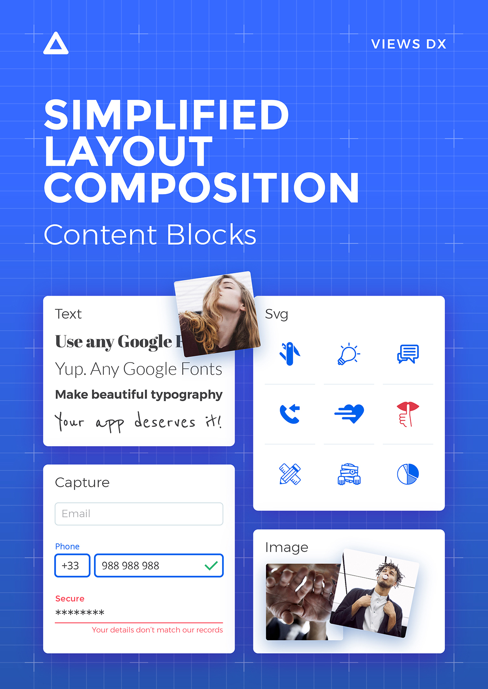
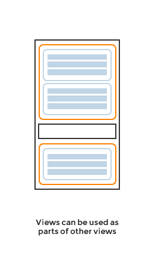
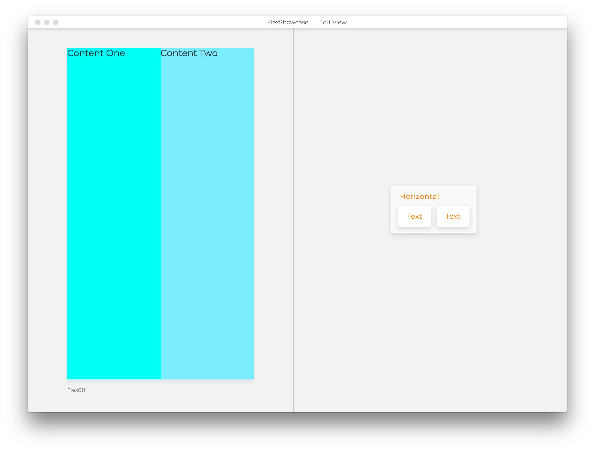

# Views
**An effective framework for creating production quality interfaces**

Views is an intuitive language to define and build complex user interfaces.
Views syntax is clean, intuitive, and functional. Here's a sample:

```
Text
color deepskyblue
text Hello. Don't be a stranger!
```

There are no divs, classes or ids. We use styled blocks to compose interfaces.
Blocks make the composition easy to understand even for non-technical professionals.

Views lets you build web, iOS, Android and Desktop applications from the same codebase by
morphing to React and React Native in JavaScript. It doesn't add a runtime
overhead to your application.

Views language and its morphers are open source.
[You can contribute here](https://github.com/viewstools/morph).

We're also working on a toolset to enhance the design and development process
even more. It is currently in closed beta and we're expecting to release
the public beta by Q1 2018. Email us at hi@views.tools and we'll let you
know when its ready. [Here is a quick (2:44s) overview 😉](https://vimeo.com/248484288).

Join conversations:
- [Spectrum Channel](https://spectrum.chat/?t=ba1ad612-c26e-446f-9aa3-76f0c7ca6c81)
- [Slack Team](https://slack.viewsdx.com/)
- [Medium Publication](https://medium.com/viewsdx)
- [Roadmap](https://trello.com/b/NhIKKbol/views-roadmap)

## 👋 How can you benefit from it?
_Views makes teams productive._ Designers contribute directly to the production build.</br>
_Views improves build quality._ Designers can tweak styling without wasting dev time.</br>
_Views compiles to React and React Native._ No manual work is required in the compilation process.</br>
_Views comes with a creative toolset._ For designers who prefer tweak over building from scratch.

You can speed up your development.</br>
Perform faster revision loops.</br>
Test innovative ideas.</br>
Reduce the cost of design iterations.</br>

## 🚀 Who is using it successfully?
- A strategic partner to deliver their core application to their 50 million users in the USA. _Web app_.
- Views toolset. _Electron Desktop app_.
- 2BFIT. _Mobile native app_ [AppStore](https://itunes.apple.com/us/app/2bfit/id1279427455?mt=8&ign-mpt=uo%3D4) [GooglePlay](https://play.google.com/store/apps/details?id=com.viewsdx.app2bfit&hl=en)
- Classuite. _Mobile native app_. [AppStore](https://itunes.apple.com/us/app/classuite-workspaces/id1329983329?mt=8) [GooglePlay](https://play.google.com/store/apps/details?id=com.classuite.workspces)

## Table of Contents
1. [Use Views in your project](UseViews/README.md)
- Open source (code driven)
- Using Views Tools (code and WYSIWYG editor for designers)
2. [Compose Views](CompositionModel/README.md)
- Atomic Design pattern
- Containers and content blocks


## Properties
Props are all that matters in Views!

They define the style and type of all States, Blocks and Views.

There are two kinds of properties:
- _Internal_: value is defined in the same .view file.
Example: `text Buy Now`, `color red`
- _External_: value comes from somewhere else (.view.tests file, service, back-end).
Example: `text props.buttonLabel`

Say, you want to change the Button's Label dynamically depending on the View
where the button is being used in?
1. Replace the value you want to make dynamic with `props.anyName`
2. Pass the value in Tests and point of use like `anyName some value`

Here's an example of replacing `text` from `Button Label` to a dynamic value
received through `props.label`.

**before**:
```views
Text
text Button Label
fontSize 20
color #f7941e
```

**after**:
```views
Text
text props.label
fontSize 20
color #f7941e
```

After changing a value to a dynamic prop it will disappear from the preview.
To bring the text back you need to add `text Button Label` to the `Button.view.tests`
like this:
```
Main Test
text Button Label
```
If you using Views Tools, you can use keyboard shortcut `CMD+d` to open test file
for the current view, or specify the value for the props in the text popup.

Let's call that view `Button`. When you use it in another view, you will have to
define the prop `label` like this:
```
Button
label Buy Now!
```

## Blocks

A `Hello World` example in Views may look like:
```views
Text
text Hello World
```

A block is defined by its type. In the example above we use `Text` type to render
text in the view.

Additionally, a block can have a name:
```views
Greeting Text
text Hello World
```
It's a good DX([Designer-Developer Experience](https://medium.com/learndx)) practice
to name your blocks. It helps you and your team to understand and find the
blocks faster. They are also the way to reference specific view elements for
automated QA testing.

The type is required, if you're using a name, it's always defined after the
name `Name BlockType`.

[Here's, around minute 52, Tom explains how to save blocks as a view and use it in another view in code)](https://youtu.be/S-5rbcnXWtI?t=51m38s).
This process is greatly simplified and more straight forward in the toolset.


### Block Type
In Views, we distinguish three types of blocks: `Containers`, `Content` and
`Custom blocks`.



*Container* blocks let you group blocks together. They are:
* `Vertical`
* `Horizontal`
* `List`

`Vertical` and `Horizontal` let you lay blocks out. `Vertical` will stack any
blocks inside of it one below the other and `Horizontal` will get them side by
side.

Views uses flexbox to lay out your blocks in the UI. It's a layout mode intended
to accommodate different screen sizes and different display devices without much effort.
[If you're curious about you can read more about flexbox here](https://developer.mozilla.org/en-US/docs/Web/CSS/CSS_Flexible_Box_Layout/Using_CSS_flexible_boxes).

In CSS terms, `Vertical` is a shortcut for `flex-direction: row`.

If you've been doing Web development for a while, you might be wondering why
we chose it over the default block mode of that CSS has. The main reasons are
that it's more predictable, meaning it's easier to use for newcomers than
`display: block`, and also that it works across platforms in native apps thanks
to Facebook's [Yoga layout engine](https://github.com/facebook/yoga).

By the way, that doesn't mean that you can't use other `display` values. See
the [quirks](QUIRKS.md) for a few cases in which we've spotted flex wasn't
cutting it for us.

`Vertical` and `Horizontal` are also actionable blocks, which is a fancy way to
say that they can take click or press events. *That's how you make buttons in
Views*, for example:

```
Button Vertical
onClick props.doSomeAction
Text
text click me
```


`List` lets you repeat one item many times.
It needs one prop, called `from` which tells where the list gets its data from.
A `List` can only take one block inside of it, so if you want more complex things,
like a card, you will want to use a container block like a `Vertical` or a `Horizontal`.

Inside a `List` you get access to an `item` and `index`. `item` has whatever your
list has and `index` tells the position of the item in the list starting at 0.

```views
List
from props.people
Text
text item.name
```

You can style a `List` as you would with any other container. By default it
stacks its elements like `Vertical` does. If you want it to stack them
horizontally, add the prop `flexDirection row` to it.


*Content* blocks let you, well, show stuff. You met one before, `Text`, let's
meet all of them:
* `Text`
* `Image`
* `Svg`
* `Capture`

`Text` is probably the block you'll use the most. Its most important prop is,
wait for it... Are you ready?!? 👉 `text`. 😱. Yeah, I know, you saw that one
coming... Sure.
A `Text` block can take almost any CSS, more importantly it takes font styles,
like `fontFamily`, `fontSize`, `fontWeight`, `lineHeight`, `letterSpacing`,
etc. And colours. Oh yeah, `deepskyblue` and `deeppink`. Now we're talking.
For the Irish, British and Australians in the world, remember that the prop is
`color` and not `colour`. 🤐.  

To embed props in a string, use template literals (backticks are not needed) e.g.
```
Text
text Welcome ${props.username}
```



We all know everyone loves web fonts. You can use those here too. Yeah, Google
fonts, Typekit, even that piece of art you have sitting in that custom woff file
in your computer would work. However, if you're using web fonts, please please
please, use `fontWeight` too. You see, we're doing some smart stuff there to
ease font loading and you're better off being specific so we don't have to load
stuff unnecessarily and make your app slower. Remember that the more fonts you
use, the more it will take for your app to load, so use them with caution. 🤓.

Here's an example of how to use it:
```views
Text
fontFamily Roboto
fontWeight 300
text nananana nananana nananana Batmannnn!!!!!!! 🍀
```

If you're using a Google Font, Views will automatically specify the right
fallback (`sans-serif`, `serif`, etc) on web for you.

There's a bit of legwork to get your fonts working in your app for now. For
React Native see [this](https://docs.expo.io/versions/latest/sdk/font.html#content). For React DOM,
use a `<link>` tag in your HTML like Google Fonts suggests or an `@import(...)`
statement in `index.css`. We will automate this in Views at some stage.

`Image` takes a `source` prop, it can be a URL or a local file. TODO

`Capture` is your way to accept written input from a user. We have a few types
defined for this:

- `CaptureEmail`
- `CaptureFile`
- `CaptureInput`
- `CaptureNumber`
- `CapturePhone`
- `CaptureSecure`
- `CaptureText`
- `CaptureTextArea`

To set content of a any capture field use `placeholder` property. Example:
```
Email CaptureEmail
placeholder john@email.com
```

To auto focus in a Capture field use `autoFocus` property. Example:
```
CaptureTextArea
autoFocus true
```

The docs for [React forms](https://reactjs.org/docs/forms.html) apply for React
DOM. For native we're [doing a bit more for you](https://github.com/viewstools/morph/blob/master/__tests__/__snapshots__/react.js.snap#L1682-L1697).
This is still work in progress and we're loooking at integrating some of the
concepts of [formik](https://github.com/jaredpalmer/formik) to easy form
creation and management without dictating UI.

_TODO Expand on captures and forms_


_SVGs are amazing_. They let you do amazing graphics that scale like crazy.
Of course you can use an `Image` block to just show an SVG file as an image
but if you want to do more crazy stuff with them, like animating parts of it
or changing how it looks like on the fly, you're better off using an `Svg`
block. Inside it, you can use a these specific blocks:

* `SvgCircle`
* `SvgEllipse`
* `SvgGroup`
* `SvgLinearGradient`
* `SvgRadialGradient`
* `SvgLine`
* `SvgPath`
* `SvgPolygon`
* `SvgPolyline`
* `SvgRect`
* `SvgSymbol`
* `SvgText`
* `SvgUse`
* `SvgDefs`
* `SvgStop`

While you can make an `Svg` by hand, like:
```views
Svg
viewBox 0 0 20 20
width 20
height 20
SvgCircle
cx 10
cy 10
r 5
stroke deepskyblue
```

It's certainly more fun that have that done automatically for you 😇. You can
run `views-morph file.svg` and 💥! You'll get a ready to go Views Svg!

[Here's a little video on how you can use it in your project today](https://medium.com/viewsdx/from-svg-to-view-in-1-2-3-79cf8d771485).

### Proximity nesting
Proximity nesting is how we do composition inside a view. You can think about your
view as a stack of blocks where new lines set blocks apart.

```
Top Vertical
InsideTop Vertical
Text
```
In the example above, the hierarchy is:
* `Top`
  * `InsideTop`
    * `Text`

What if we want to have the text at the same level of `InsideTop`? Our code
would look like:

```
Top Vertical
InsideTop Vertical

Text
```

Our hierarchy now looks like:
* `Top`
  * `InsideTop`
  * `Text`
That new line before `Text` separates it from `InsideTop`.

This is a rule that applies to almost all blocks except the following content
blocks: `Image`, `Text`, `CaptureEmail`, `CaptureFile`, `CaptureNumber`, `CapturePhone`,
`CaptureSecure`, `CaptureText`, `CaptureTextArea`, `Proxy`, `SvgCircle`, `SvgEllipse`, `SvgLine`,
`SvgPath`, `SvgPolygon`, `SvgPolyline`, `SvgRect`, `SvgText`, `SvgStop`.

With that in mind, if we want to have two `Text`s next to each other, we don't
need a new line between them. The following code:
```
Top Vertical
Text
Text
```

Gives us the hierarchy we're after:
* `Top`
  * `Text`
  * `Text`

A view can only have one top level block. If you have more than one, only the
first one will be displayed. E.g.:

```
Top Vertical
Text

Text
```
In the example above, the second `Text` is outside of the top level container
therefore it won't be displayed.

## Scope properties
Setting one or multiple conditions on a block will define the way it will render.
There are two ways you can take advantage of the scopes on any given block:
1. To control how a block looks like when rendered in the view
2. To show or hide a block from the view

Scopes are defined in the logic files, back-end, or via service call.
Each scope depends on the value passed to respective prop.

General syntax rules:
1. `when` the `props.conditionName` is true, display
2. `!props.conditionName` is a negation of the value passed to the prop
3. There is a base scope which includes all the properties of the block without
leading `when` statement.
4. Properties included in each scope have to also be used in the base scope
with a default value.

### Control properties of blocks dynamically
Blocks and Views can have many scopes driven by `when` statements.
Basic example:
```views
Button Vertical
backgroundColor white
onClick props
when props.isClicked
backgroundColor green
Label Text
color black
text Click me
when props.isClicked
color white
text I was clicked
```
This comes handy when you want to change a block on interaction, or when you
want to animate transitions.

There is a specific structure to a block with `when` properties.

Styling properties positioned directly below the name, and type, of a block become the
base style. They can be changed based on passed props conditions. From the example above:
`when props.isClicked` is a condition added to the Button wrapping the Text block.
Above this `when` condition, and as a part of base style, you can position any
styling properties, we use `backgroundColor white`.

Below the `when` condition you can overwrite the conditions from the base styles.
We change background color of the button to `green` using `backgroundColor green`.

There can be any number of the `when` conditions within the block you need.
After adding properties below each `when`, remember to add it also to the base
style with a default value.

`when` conditions can be triggered on any basic blocks and custom views.
The `when` property doesn't have to be passed down to the custom view manually.
It will apply automatically. So, this is also valid even tho Title view doesn't
have the `when props.when` specified anywhere within the view.

```views
Button Vertical
backgroundColor white
onClick props
when props.isClicked
backgroundColor green
Label Text
color black
text Click me
when props.isClicked
color white
text I was clicked
SubTitle
marginTop 5
text Go for it!
when props.isClicked
text Nicely done!
```
Where `SubTitle` view is saved as `SubTitle.view` file within the project and
has:
```views
SubTitle Text
marginTop props
color #ffaa00
fontFamily Montserrat
fontSize 16
text props
```
As you see, there is no `when` props in the custom view but the `text` values
is changing based on the `isClicked` condition specified in `Button.view.test` file.
Here's how we pass the temporary test mock data to the Button using tests:
```
Main Test
isClicked false

Clicked Test
isClicked true
```
All the conditions above result in this interface:


### Control when blocks are rendered/shown

You can use `onWhen` condition as part of the base scope to act as a rendering
switch, and show or hide the block.

```views
Popup Text
text Yoohoo!
onWhen props.goesYoohoo
```
At this point `props.goesYoohoo` expects a boolean value and can be set
as true or false in the Props block. An example would look like:
```
Props
when Popup is visible
goesYoohoo true
when Popup is not visible
goesYoohoo false
```
If you use Views Tools you will see two artboards in the preview with Popup block
shown in the first one and not visible in the second.

The Popup will be rendered in the view of the final production build based on the
value of the `props.goesYoohoo` passed from the `Popup.view.logic.js` file, from
the back-end, or via an API call. By default the Popup will not render.

### Javascript ternaries are no longer supported
With the simplification of `when` conditions, ternaries like:
`text props.isClicked ? 'Nicely done!' : 'Go for it!'`
are no longer supported.

Read more about this point in our [Useful Conventions](#useful-conventions) section.

## ✨ Tests

### Contract between .view and view.tests files
Tests allow us to pass temporary data to the view that has external properties (props) defined.
In this simple example, `text` value is specified within the view file:
```views
Text
text Hello
```
To make `text` value dynamic we need to turn it into a prop, like this:
```views
Text
text props
```
At this point the Text block with disappear from the preview because the value
for the `text` property is exposed as an external connection, but there is no
value passed to it yet.

To bring back the `Hello` value to display in the preview create the `Text.view.tests`
file in the same folder where `Text.view` file is saved. Inside of it write:
```
Main Test
text Hello
```
If you use Views Tools, use keyboard shortcut `CMD+d` to automatically open the
tests file (if this file doesn't exist yet, Tools will create it for you).

Now, you will see the `Hello` text back in the preview passed from tests to
mock the real data.

### Tests are not real!
This is an important detail.

All tests will be discarded at the point of running the React project.
Tests are not included during the compilation process and each value should
be either specified at the point of use within other view files, or come
from the external source, like logic file, your back-end, or an API call.

If you use Views Tools, and see the value in the preview, but cannot see it
in the final build, it could mean couple of things:
- You are not passing the props down the nesting tree. Solution: Trace the nesting path
from the point of use down to the view that doesn't render. Make sure connections
are made on every level. Check the naming and spelling.
- The prop is not receiving the value from the state. Solution: Add the prop with
the same name in the logic file.
- The prop is visible but it has a wrong value. Solution: Check the conditions
set by `when` properties.

### Toggle interactions using tests

If you use Views Tools, and want to simulate transitions within Views, you need to:
- have an `onClick props.login` property in the `Login` button to make the button actionable.
Example:
```views
Button Vertical
onClick props.login
Text
text Log In
when props.loading
text Loading...
```
- add two tests in `LoginButton.view.tests` file to read:
```
Main Test
login Loading
loading false

Loading Test
login Main
loading true
```
Now you can click on the button in the preview and the text will change from
`Log In` to `Loading...`. This way you can test the interactivity of your interface
during the design process.

Toggling using tests is not routing, or swapping actual state of the component.

You will not be able to use this toggling syntax in the production build
since tests are being discarded from the final build.

This only works in Views Tools.

### Naming convention

To avoid errors, make sure your tests comply with these simple rules:
1. Always start the test name with a capital letter: `Main Test`
2. Always specify where the test starts by adding `Test` after name as a type.
3. Don't start the test name with a number.
4. Don't use any special characters like dashes or parenthesis.

### Need help?

Tests might be tricky. Reach out with questions via our
[Slack Questions Channel](https://slack.viewsdx.com/). Mention `@views-tom` or `@dario`
to make sure that we get the notifications.

## View
### Easy in, Easy out
There is no view without `.view` file.

Each saved view will be morphed (compiled) to production quality JavaScript and
saved as `.view.js` file.

If on some point you decide you don't need Views anymore you can always use
generated components located in `.view.js` files without redoing the interface.

### Embedding Views
Views can be used in other views through their file name.



Common use case: Say you have a View that contains a button with a text label and
you want to choose different font size for it. You will want to change it in one
place instead of in every place of use.
1. Extract the button code to separate .view file and save it as file
starting with a capital letter
2. Replace the previous button code with only the name of the extracted View,
in our example it's `Filename`
3. From now on `Filename.view` is your Custom Block and you will
see it being updated across your app upon any new changes.

This is a simple View with one Text Block BEFORE using it as a Custom Block:
```views
Text
text Button Label
fontSize 20
color #f7941e
```

And here's how it should look like AFTER turning Text Block into a Custom Block:
```views
Filename
```

Calling Views by the `Filename` requires the `Filename.view` in src
folder with the code you want to inject. In the example above, `Filename.view` should have:

```views
Text
text Button Label
fontSize 20
color #f7941e
```

Custom Blocks are capable of storing Properties, States, and Blocks, and even
another Views or Smart Views.

Since any existing .view file is a Custom Block by default anyone can create, manage,
and delete them. It makes the composition pattern accessible to designers and
non-technical team members.

## .view.logic.js === Smart View
Any View file can be also wrapped with JavaScript logic to make a Smart View.

With `Counter.view` file like:
```
Text
color black
text props.number
```

We can add a `Counter.view.logic.js` file that would increment a number by one
every second like this:
```
import Counter from './Counter.view.js'
import React from 'react'

export default class CounterLogic extends React.Component {
  state = {
    number: 0,
  }

  componentDidMount() {
    this._interval = setInterval(this.increment, 1000)
  }

  componentWillUnmount() {
    clearInterval(this._interval)
  }

  increment = () => {
    this.setState({
      number: this.state.number + 1
    })
  }

  render() {
    return <Counter number={this.state.number} />
  }
}
```

A logic file is an extension to your view and Views imports that it if it's
available. In other words, if you then use your `Counter` in other views, you
will actually be using the `Counter.view.logic.js` instead.

This is where you would add any intermediate state to your views or connect them
to an external store of data.

## local state
Like a react component, your view can have local state, which you can pass to your logic component.  
For example, let's say you have a form with an input field and a submit button. On pressing the button you want to get the current value in the input field and pass that to your logic component. That would look like this:
```
Username CaptureText
placeholder Username
Button Horizontal
onClick () => props.handleSubmit(state)
Text
text Submit
```

Then, in your view logic you would get the value like so:
```
 handleSubmit = state => {
   this.setState({
     username: state.username,
   });
```
## How to work with Flexbox properties
Flexbox is a part of CSS standards. We use flexbox to manage layout composition
of blocks, specifically, we use it to control:
1. Sizing
2. Alignment
3. Distribution

### Defaults
Every block, by default, has `display flex` property enabled.
Horizontals have `flexDirection` set to `row`, and Verticals to `column`.

### Flex 1
When you apply `flex 1` to a block, it will try to take as much space as it's
possible in the view. Check how the examples below are affected by this property,
and as a rule of thumb, add `flex 1` to blocks, when you need them to push
other blocks away, or take more space.

#### 001. No flex 1

```views
FlexTest Vertical
backgroundColor #ffaa00
Text
backgroundColor #00fff7
color #323232
fontFamily Montserrat
fontSize 18
fontWeight 400
text Content
```

#### 002. Flex on the Vertical only

```views
FlexTest Vertical
flex 1
backgroundColor #ffaa00
Text
backgroundColor #00fff7
color #323232
fontFamily Montserrat
fontSize 18
fontWeight 400
text Content
```
#### 003. Flex on the Vertical and on the Text block

```views
FlexTest Vertical
flex 1
backgroundColor #ffaa00
Text
flex 1
backgroundColor #00fff7
color #323232
fontFamily Montserrat
fontSize 18
fontWeight 400
text Content
```

#### 004. Flex on the Horizontal only

```views
Horizontal
flex 1
backgroundColor #ffaa00
Text
backgroundColor #00fff7
color #323232
fontFamily Montserrat
fontSize 18
fontWeight 400
text Content
```

#### 005. Flex on the Horizontal and Text

```views
Horizontal
flex 1
backgroundColor #ffaa00
Text
flex 1
backgroundColor #00fff7
color #323232
fontFamily Montserrat
fontSize 18
fontWeight 400
text Content
```
#### 006. No Flex 1 on the Vertical or on nested blocks

```views
Vertical
backgroundColor #ffaa00
Text
backgroundColor #00fff7
color #323232
fontFamily Montserrat
fontSize 18
fontWeight 400
text Content One
Text
backgroundColor #00fff7
color #323232
fontFamily Montserrat
fontSize 18
fontWeight 400
text Content Two
```

#### 007. Flex only on the Vertical (with nested blocks)

```views
Vertical
flex 1
backgroundColor #ffaa00
Text
backgroundColor #00fff7
color #323232
fontFamily Montserrat
fontSize 18
fontWeight 400
text Content One
Text
backgroundColor #00fff7
color #323232
fontFamily Montserrat
fontSize 18
fontWeight 400
text Content Two
```

#### 008. Flex on the Vertical and on nested blocks

```views
Vertical
flex 1
backgroundColor #ffaa00
Text
flex 1
backgroundColor #00fff7
color #323232
fontFamily Montserrat
fontSize 18
fontWeight 400
text Content One
Text
flex 1
backgroundColor #00fff7
color #323232
fontFamily Montserrat
fontSize 18
fontWeight 400
text Content Two
```

#### 008A. Flex on the Vertical and on one nested block only

```views
Vertical
flex 1
backgroundColor #ffaa00
Text
flex 1
backgroundColor #00fff7
color #323232
fontFamily Montserrat
fontSize 18
fontWeight 400
text Content One
Text
backgroundColor #7aedff
color #323232
fontFamily Montserrat
fontSize 18
fontWeight 400
text Content Two
```
#### 009. No Flex 1 on the Horizontal or on nested blocks

```views
Horizontal
backgroundColor #ffaa00
Text
backgroundColor #00fff7
color #323232
fontFamily Montserrat
fontSize 18
fontWeight 400
text Content One
Text
backgroundColor #7aedff
color #323232
fontFamily Montserrat
fontSize 18
fontWeight 400
text Content Two
```

#### 010. Flex only on the Horizontal (with nested blocks)

```views
Horizontal
flex 1
backgroundColor #ffaa00
Text
backgroundColor #00fff7
color #323232
fontFamily Montserrat
fontSize 18
fontWeight 400
text Content One
Text
backgroundColor #7aedff
color #323232
fontFamily Montserrat
fontSize 18
fontWeight 400
text Content Two
```

#### 011. Flex on the Horizontal and on nested blocks

```views
Horizontal
flex 1
backgroundColor #ffaa00
Text
flex 1
backgroundColor #00fff7
color #323232
fontFamily Montserrat
fontSize 18
fontWeight 400
text Content One
Text
flex 1
backgroundColor #7aedff
color #323232
fontFamily Montserrat
fontSize 18
fontWeight 400
text Content Two
```

#### 011A. Flex on the Horizontal and on one nested block only

```views
Horizontal
flex 1
backgroundColor #ffaa00
Text
flex 1
backgroundColor #00fff7
color #323232
fontFamily Montserrat
fontSize 18
fontWeight 400
text Content One
Text
backgroundColor #7aedff
color #323232
fontFamily Montserrat
fontSize 18
fontWeight 400
text Content Two
```

## .view.tests.json
TODO 💾

## animations
TODO

## routes and teleports
TODO
```
App Vertical

Home Vertical
at /
Text
text main
Vertical
teleportTo page
Text
text go to page


Page Vertical
at /page
Text
text some page

Vertical
teleportTo ..
Text
text back
```

## Views and your React components
If you want to use an existing React component as is, you can import it by
defining it as a `.js` file and adding a `// @view` pragma at the top.

E.g., say you have a file called `Magic.js`:

```
// @view
import React from 'react'

export default props => props.word
```

You can now use that component as you would use any other view in your system:

```
Magic
word hey!
```

We'll be working on bridging NPM modules at some stage, but for now you can
bridge any external modules by hand. Here's an example with
[react-google-maps](https://tomchentw.github.io/react-google-maps/).

`GoogleMap.js`
```
// @view
import { GoogleMap } from 'react-google-maps'
export default ({ defaultCenterLat: lat, defaultCenterLng: lng, ...props }) => (
  <GoogleMap defaultCenter={{ lat, lng }} {...props}>
    {props.children}
  </GoogleMap>
)
```

`Marker.js`
```
// @view
import { Marker } from 'react-google-maps'
export default ({ positionLat: lat, positionLng: lng, ...props }) => (
  <Marker position={{ lat, lng }} {...props} />
)
```

Then in your view, following [the example from their docs](https://tomchentw.github.io/react-google-maps/#usage--configuration):

```
GoogleMap
defaultZoom 0
defaultCenterLat -34.397
defaultCenterLng 150.644
Marker
positionLat -34.397
positionLng 150.644
when props.isMarkerShown
```

You will notice that we've renamed certain props and flattened them out. In
order to reduce the complexity of the language we made a decision not to allow
complex objects in views as props for now. This isn't set in stone though, so if
you feel strong about it, let us know and we can work to enable a syntax like:
```
GoogleMap
defaultZoom 0
defaultCenter
lat -34.397
lng 150.644
Marker
position
lat -34.397
lng 150.644

when props.isMarkerShown
```

### .view.fake

When you add a `.js` view, our toolset will let you define a `.view.fake` file
that mocks your `.js` component. A `.js` component like our `Magic` or
`GoogleMap` components above are external and as such can't be modified in
Views. However, it's handy to have some kind of representation of them in your
preview. That's when the `.view.fake` comes into play. Take `GoogleMap` for
example, it's fake view could look like:

```
GoogleMapFake Image
source ./google-map-fake.jpg
```

## Syntax highlighting
We’ve created the following packages to help you understand `.view` files better:
* [Atom](http://atom.io/packages/language-views),
* [Sublime](https://github.com/viewstools/syntax-sublime),
* [VIM](https://github.com/viewstools/syntax-vim), and
* [VSCode](https://marketplace.visualstudio.com/items?itemName=uxtemple.views).

We currently highlight block names, numbers, props, and strings. Our highlighters
aren’t perfect, but they should get us started. Feel free to submit fixes and suggestions!

If you’re using other editors and come up with a syntax highlighter for it, reach out,
and we’ll add it to this list.

Happy editing!

## I ran views-morph on my project, and it created a bunch of other files, what's going on?
Say you have a View called `My.view`. When morphing it, Views will create a file
called `My.view.js`. If you're morphing to `react-dom`, it will also create a
`My.view.css` that gets automatically imported. You can avoid that external CSS
file altogether by running the morpher like `views-morph My.view --as react-dom
--inlineStyles`. You can safely ignore these files as they'll be created on the
fly when the morpher runs.

## Useful Conventions
### Always name blocks
### Extract blocks as view files
### Don’t name props unless you absolutely have to
### Keep props simple
### Don't repeat blocks, use lists
### Design System folders
### Sensible Duplication
### For readability, put the onWhen property as a first line below the block's name

## Blocks Examples

## Views is a knowledge transfer platform!
The value of cross-functional teams is very well known to Growth Hacking community
and it's explained well in this book [Hacking Growth: Fastest Growing Companies Breakout](https://www.amazon.com/Hacking-Growth-Fastest-Growing-Companies-Breakout/dp/045149721X)


Views helps build fast experiments that can be expanded to fully featured products
and don't end up thrown away after testing, like it's in a case of prototypes.

Every team that introduced non-technical members using Views on an early stage of
product development noticed massive spikes in productivity, motivation, and cross-domain
knowledge transfer.

_We learn the best from each other and on the job_

Because Views syntax, composition, state and logic concepts are much easier to
grasp than in a typical HTML, CSS, JS stack, non-technical team members have fewer
barriers to start writing code.

_We think that the code we write should be beautiful, meaningful, and simple_

As a collaboration platform Views removes silos and brings down the walls between
development and the rest of the organisation.

_We cherish openness, learning, and frequent shipping_


## 😍 How can I help?
We're thrilled you want to help us make better UIs together 😀.
You can contribute to the docs on [this repo](https://github.com/viewstools/docs)
and to [Views morphers here](https://github.com/viewstools/morph).

If you have any questions, you can always find us on:
- Slack https://slack.views.tools,
- Email hi@views.tools,
- Twitter [@viewstools](https://twitter.com/viewstools), and
- [Spectrum](https://spectrum.chat/views).

We sometimes write stuff on our [Medium publication](https://medium.com/viewsdx) too.

License BSD-3-Clause.<br>
Copyright 2017 by UXtemple Ltd.
