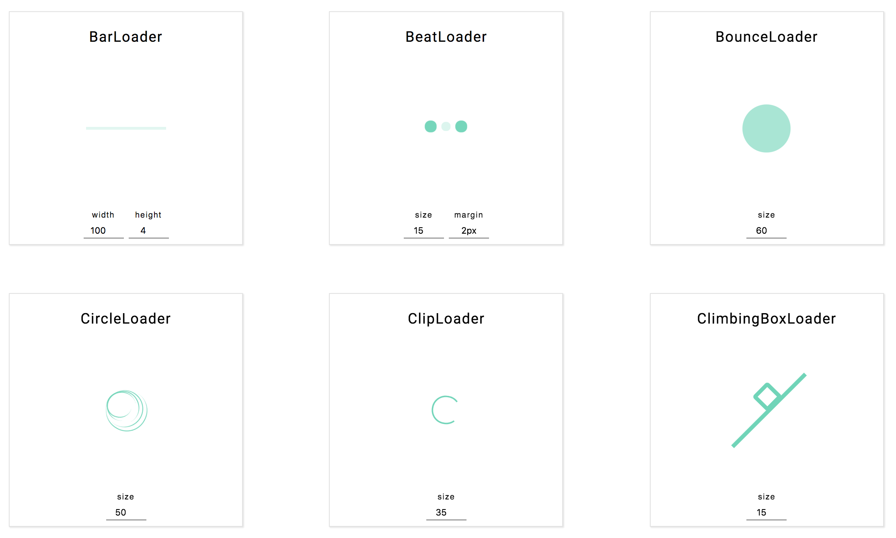

# Views and your React components

If you want to use an existing React component as is, you can import it by
defining it as a `.js` file and adding a `// @view` pragma at the top.

## Integration pattern

E.g., say you have a file called `Magic.js`:

```
// @view
import React from 'react'

export default props => props.word
```

You can now use that component as you would use any other view in your system:

```
Magic
word hey!
```

We'll be working on bridging NPM modules at some stage, but for now you can
bridge any external modules by hand.

## Google Maps integration

Here's an example with
[react-google-maps](https://tomchentw.github.io/react-google-maps/).

`GoogleMap.js`

```
// @view
import { GoogleMap } from 'react-google-maps'
export default ({ defaultCenterLat: lat, defaultCenterLng: lng, ...props }) => (
  <GoogleMap defaultCenter={{ lat, lng }} {...props}>
    {props.children}
  </GoogleMap>
)
```

`Marker.js`

```
// @view
import { Marker } from 'react-google-maps'
export default ({ positionLat: lat, positionLng: lng, ...props }) => (
  <Marker position={{ lat, lng }} {...props} />
)
```

Then in your view, following [the example from their docs](https://tomchentw.github.io/react-google-maps/#usage--configuration):

```views
GoogleMap
defaultZoom 0
defaultCenterLat -34.397
defaultCenterLng 150.644
Marker
onWhen <isMarkerShown
positionLat -34.397
positionLng 150.644
```

You will notice that we've renamed certain props and flattened them out. In
order to reduce the complexity of the language we made a decision not to allow
complex objects in views as props for now. This isn't set in stone though, so if
you feel strong about it, let us know and we can work to enable a syntax like:

```views
GoogleMap
defaultZoom 0
defaultCenter
lat -34.397
lng 150.644
Marker
onWhen <isMarkerShown
position
lat -34.397
lng 150.644
```

## Loaders

Create `Spinner.js` in your project and add this code to it:

```
// @view
import * as Spinners from 'react-spinners';
import React from 'react';

const Spinner = ({ type, ...props }) => {
  const Type = Spinners[type];
  return <Type loading={true} {...props} />;
};
Spinner.defaultProps = {
  type: 'ClipLoader',
};
export default Spinner;
```

Views Moprher will auto-generate `Spinner.view.js` file for you.

You can now use a `Spinner` block in any view on its own or together with setting a type of spinner:

```
Spinner
type ClipLoader
```

Here's the link to NPM package with all [spinner options](https://www.npmjs.com/package/react-spinners)
And here's the [demo page](http://www.davidhu.io/react-spinners/)



Customise your loader with additional properties:

```
Spinner
type BarLoader
width 100
height 4
color #ff8300
```

## .view.fake

When you add a `.js` view, our toolset will let you define a `.view.fake` file
that mocks your `.js` component. A `.js` component like our `Magic` or
`GoogleMap` components above are external and as such can't be modified in
Views. However, it's handy to have some kind of representation of them in your
preview. That's when the `.view.fake` comes into play. Take `GoogleMap` for
example, it's fake view could look like:

```
GoogleMapFake Image
source ./google-map-fake.jpg
```

Reach out with questions via our [Slack Questions Channel](https://slack.viewsdx.com/).
Mention `@tombrewsviews` or `@dario` to make sure that we get your notifications.
